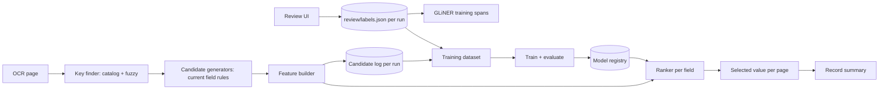

> **Superseded in part.** The plan below was written for the earlier layout (separate candidate CSVs, `review/labels.json`, one ranker). Extraction is now two models (KV_Extraction, Heading_Detector) and one folder of CSV tables per run: see `HOW_IT_WORKS.md` sections 6 to 9 for the current design.

# Trainable KV Extraction: Plan

Turn the one-pass KV pipeline (`run.py` → `pipeline.py`) from hand-tuned rules into a system that
learns from manual review, can be retrained, and whose versions can be compared on a fixed test set.

## Agreed decisions

| Decision | Choice |
|---|---|
| Architecture | Hybrid: rules generate candidates, a trained model scores them and picks the answer |
| Review tool | The Review UI only, upgraded to review every field and add values the rules missed |
| Earlier label data | Ignored: Master Data annotations and reviews saved before the upgrade are not used |
| Storage | Same as today: CSV / JSON / XLSX inside each run folder; no new file formats |
| Label granularity | Final value per field per page; candidates are labelled automatically by value matching |
| Layout identity | Known per record; recorded in `record_sources.csv` (RecordId, Source) |
| First review round | 200 to 1,000 pages |

## Where we are today

- **Pipeline.** Each page is parsed once, keys are found once (catalog + fuzzy + look-alike matching),
  and each field's rules produce candidate rows (`DobHit`, `IdHit`, `NameHit`, `ProviderHit`,
  `ESigHit`, `DosHit`, `PageHit`) with `Score`, `Accepted`, `Selected`.
- **Selection is hand-written.** Tiers, "header/footer first", majority, fixed scores (0.92 after key,
  0.85 keyless adjacent, ...). This is the part a model should learn.
- **Candidate log (Phase 1, done).** Every run writes every candidate with its features, see below.
- **Review UI (Phase 2 UI, done):** home page of batches (runs) with accuracy, rerun with a chosen
  model version, and accuracy per version; batch review page with all 7 fields, candidate verdicts,
  missed values picked from OCR words, and "not on this page". See `Review_UI/README.md`.

**Status (training code):** `dataset.py`, `model.py`, `train.py` and `evaluate.py` are built
(Phase 2 step 2's automatic candidate labelling, Phase 2 step 3's CLI evaluation, Phase 4 steps
1 to 3, and a heading classifier). A trained version runs through `run.py --model-version vNNN`
and the UI's Rerun popup. First full cycle (27 Sep 2026): one batch of 4 documents / 49 pages
fully reviewed (reruns of it are auto-reviewed from the pooled labels); rule fixes guided by
`rules_check.py` took v0 from 68.0% to 94.1% pair accuracy; `v001` trained on it reaches 95.5%
on the same pages (optimistic: none of the 4 documents is a test record). What's missing is
more documents, so that test records exist. Not built yet: `compare.py` (evaluate.py covers v0 vs one version),
`active.json` / promotion, active-learning page selection, GLiNER fine-tuning.

## Architecture

- **v0** is today's rules with today's selection. It stays the baseline and the fallback.
- The ranker never invents values. It only chooses among candidates or chooses none. Improving what
  the rules can find (recall) stays a rules and catalog job, now guided by data (Phase 3).

## Data model

Run outputs stay under `Data/Output/Runs/KV_Run_*`; compiled training data under `Data/Output/Training/`
(`config.Training_Data`); trained models under `Models/kv_ranker/`. All are git-ignored. Labels contain
patient names, DOBs and IDs, so nothing leaves the machine.

### Page identity

`(RecordId, FileName, PageNumber)` plus `ocr_sha1`, a hash of the page's OCR words. Labels stay valid
across reruns. If a page is re-OCRed and its text changes, its labels are flagged for re-check.

### Candidate log (done)

`KV_Run_*/candidates/{RecordId}.csv`: one row per candidate the rules produce, plus one placeholder row
(`is_placeholder=1`) for each page and field with nothing found. Code: `Training/features.py`,
`Training/normalize.py`; written by `run.py` for every document.

| Group | Columns |
|---|---|
| Identity | run_id, model_version, catalog_hash, ner_model, record_id, source_system, file_name, page_number, page_count, ocr_sha1, field, candidate_id, is_placeholder |
| Rule output | key, region, rule_source, rule_score, rule_accepted, rule_selected, value, value_norm, detail (DOS tier / provider profile / e-sign date / page total) |
| Key | key_text (as printed), key_match (exact / regex / fuzzy / lookalike / keyless), key_edit_distance, key_trusted_reason (edge / cluster / role_key / dos_strong_key / esig_phrase / patient_near_key), key_weak, key_cluster_size, key_n_words, key_words (OCR word indexes), key box x0 y0 x1 y1 (0..1) |
| Value location | value_found, value_words (OCR word indexes), value box x0 y0 x1 y1 (0..1), relation (right / left / below / above / overlap / keyless), word_gap, line_gap, dx |
| Value shape | value_len, value_n_words, digit_ratio, alpha_ratio, upper_ratio, has_comma, has_initial, value_is_date |
| Page context | page_w, page_h, page_frac, n_keys_page, n_trusted_keys_page, n_field_keys, n_field_candidates, n_field_accepted, page_value_count, page_distinct_values |
| Record context | record_value_pages, record_value_share, record_distinct_values |

`candidate_id = sha1(RecordId, PageNumber, field, key, key word indexes, value_norm, rule_source)`,
stable across reruns of the same OCR.

### Value normalisation (used to match labels to candidates)

| Field | Normalised form |
|---|---|
| DOB | ISO date (`Util.dates.canonical_date`) |
| DOS | `from\|to` ISO pair |
| Member ID | uppercase letters and digits only |
| Member / Provider / e-sign name | case-folded words of 2+ letters, sorted; titles, suffixes, credentials removed |
| Page No | `page/total` |

### Labels

The Review UI saves `{run}/review/labels.json` (schema_version 2, `Training/labels.py`) and an Excel
copy `{run}/review/manual_review.xlsx`. One entry per (page, field):

| Key | Meaning |
|---|---|
| candidates | `candidate_id` → verdict (`correct` / `incorrect`) and reason (wrong_value, partial, wrong_field, wrong_person, wrong_date, ocr_error, not_a_value); extracted candidates must all be judged |
| added | values the rules missed: value as printed, optional key text, and the OCR word indexes of value and key (`value_words`, `key_words`); e-sign also takes the signature date |
| not_present | the field is not on the page |
| truth | derived: correct candidates + added values, each with value_norm and word indexes |
| extracted, correct | what that run selected, and whether it equals the truth |
| notes, reviewer, reviewed_at, ocr_sha1 | provenance |

Accuracy of any run uses the latest label per (page, field) across all runs, skipping labels whose
`ocr_sha1` differs from the run's page. Reviews saved before the upgrade (`reviews.json`) are ignored.

### Automatic candidate labelling

- A candidate is **positive** when its `value_norm` equals the label's `true_value_norm`.
- `correct`: the selected candidate is positive, and so is any other candidate with the same value.
- `wrong` or `missing` with a true value: matching candidates are positive. If none match, the page is
  a **generator miss**. It's logged for rule and catalog work, not used for ranker training.
- `not_present`: every candidate is negative.

## Review UI upgrade (Phase 2)

- **All 7 fields**, DOS and Page No included.
- **One verdict per field per page:** Correct / Wrong / Missing / Not on page, shown next to the overlay.
- **Pick instead of type:** the other candidates for that field on that page are listed (from the
  candidate log); clicking one makes it the true value.
- **Add what was missed:** type the value, or click its words on the overlay, and optionally the key
  words, which fills `true_value` / `true_key` with their positions.
- **Queue of pages to review:** first a stratified sample across records and fields, later the pages the
  active-learning step proposes (close top-two scores, model and v0 disagree, generator misses).
- Existing per-hit review fields stay, so nothing reviewers use today is lost.

## Datasets and splits

- **Test set:** about 20% of reviewed records, split by record and never by page, because pages of one
  record share names, IDs and layouts. A record is a test record when a hash of its id falls in the
  1-in-5 bucket (`dataset.is_test_record`), so the split is fixed per record and only grows; the test
  records are listed in `Data/Output/Training/splits/test_v1.txt`. Stratifying by `source_system` waits for
  `record_sources.csv`.
- **Training and tuning:** the remaining records, using grouped cross-validation by record.
- **Dataset snapshots:** `Data/Output/Training/datasets/ds_YYYYMMDD_HHMM/` holds the joined candidates and
  labels, with a manifest (label counts per field and verdict, run ids, catalog hash, git commit).

## Evaluation

`Training/evaluate.py --version v001 --split test` scores v0 and the version on the same dataset
candidates, prints a report and writes `metrics_test.json` into the version folder. Record accuracy
and the per-source / per-key error breakdown below are still to do.

| Metric (per field) | Definition |
|---|---|
| Accuracy | key-value pairs: right / (right + wrong + missed). An extracted pair is right when key and value are both correct, wrong when either is wrong; a true pair not extracted is missed. A `not_present` page with nothing extracted is one right (same as the UI, `labels.score_pairs`) |
| Precision | right / (right + wrong) |
| Recall | right / (right + missed) |
| False positives | pairs extracted on `not_present` pages |
| Candidate recall | true pairs that are among the candidates. This is the ceiling the ranker can reach, and it separates finding errors from choosing errors |
| Record accuracy | record summary value (DOB, Name, ID, ...) equals the record's true value |

The report breaks errors down by source system, region, key, relation and match type, with example
pages. `Training/compare.py v0 v003` puts two versions side by side per field and flags regressions.

## Versioning and registry

- A version is: rules code (git commit), key catalogs (`catalog_hash`), the GLiNER model (`ner_model`,
  now `gliner_low`), ranker artifacts and thresholds.
  **v0** means rules only (`pipeline.MODEL_VERSION`).
- `Models/kv_ranker/vNNN/` contains `ranker_{field}.txt` (LightGBM), `level_{field}.txt` (heading
  level), `features.json`, `thresholds.json` (per-field minimum probability to select anything),
  `manifest.json` and `metrics.json` (test-set results).
- `Training/registry.py` lists the versions (`config.Model_Registry`) for the UI's rerun dialog; a
  version with a manifest naming trained fields is runnable. `run.py --model-version` stamps the
  version into the run; the candidate log keeps `rule_*` and adds `model_score` / `model_accepted` /
  `model_selected` / `model_level`.
- `Models/kv_ranker/active.json` names the version the pipeline uses. Runs stamp it into the queue and
  the candidate log.
- **Promotion rule:** key-value pair accuracy improves overall on the test set and no field drops more than one
  point. Otherwise the version stays in the registry unpromoted.

## Phases

### Phase 1: Instrument the pipeline (done)

- `KeyHit` records `match`, `edit_distance`, `trusted_reason`, `cluster_size` (`Util/keys.py`).
- Every field row keeps a `key_hit` link to the key it was read from (not part of any output column).
- `Training/features.py` + `Training/normalize.py` build the candidate log; `run.py` writes
  `candidates/{RecordId}.csv` and stamps `model_version` / `catalog_hash` into the queue.
- **Check passed:** a full run's detail CSVs and both `extraction.xlsx` sheets are identical to the run
  before the change (timing columns aside). 512 log rows for 49 pages; 285 of 286 accepted values were
  located on the page.

### Phase 2: Review loop and baseline

1. Review UI upgrade (above), saving labels in the run folder with the new schema version. **Done.**
2. `Training/labels.py`: labels, pooled labels across runs, per-run accuracy. **Done.** Automatic
   candidate labelling for the ranker dataset is still to do.
3. Accuracy per run and per model version is in the UI. **Done.** CLI `evaluate.py` (precision,
   recall, candidate recall, record accuracy, test split) and `compare.py` are still to do.
4. First review round, then publish **v0 metrics**: the first real accuracy numbers for the current
   rules.

### Phase 3: Data-driven tuning (no ML yet)

1. **Key reliability table:** precision and volume per key × match type × region × relation. Unreliable
   keys are demoted and reliable ones promoted, as catalog or trust-rule changes a person approves.
   The first log already shows candidates: fuzzy `Report Date` matching "reported at" in review-of-
   systems lines, `Office Visit on` matching prose, `Exam Date` matching "exudate", `SSN` matching
   "am s", and `MAN` claiming real `MRN:` keys.
2. **Location priors:** where each field's true value sits, per source system. These replace fixed
   keyless bands where the data disagrees with them.
3. **Missed-key mining:** from `missing` labels with a marked key, the printed key text ranked by
   frequency is proposed as new catalog keys.
4. **Threshold search:** band sizes, fuzzy distances and minimum lengths, NER minimums, grid-searched on
   the training split and scored with `evaluate.py`.
5. Accepted changes ship as rules version **v0.x**, compared against v0 on the test set.

### Phase 4: Learned ranker

1. One LightGBM model per field, trained as a ranker over each (page, field) candidate group, with a
   per-field "select nothing" probability threshold tuned for accuracy on `not_present` pages.
2. `Training/train.py --dataset ds_x --version v001` trains, calibrates, evaluates on the test set, and
   writes the registry folder with a feature-importance report.
3. `pipeline.py` loads the active version, scores candidates, and sets `Selected`. Record summaries use
   the model's probabilities instead of majority vote. If no model is active or a field has none, it
   falls back to v0 selection.
4. Compare v001 with v0 and promote under the promotion rule.

### Phase 5: Continuous loop

Each review batch goes through label compile, dataset snapshot, retrain, evaluate, compare and promote.
Active-learning selection proposes the next batch. The test set only grows.

### Phase 6 (optional, from about 2,000 to 3,000 labelled pages)

Fine-tune GLiNER low on labelled value spans, or a layout-aware model (LayoutLMv3), as an extra
candidate generator and feature. It needs much more data than Phase 4 (1,000+ pages across many
templates), and is practical on the local RTX 3060 with the CUDA build of torch (slow on CPU).

The training data is already collected by the review: `Training/ner_export.py` writes
`Data/Output/Training/ner/gliner_train_*.json` (`tokenized_text` = OCR words in reading order in windows of
up to 256, `ner` = [start, end, label]) from pages where every NER field is reviewed, so unmarked words
are true negatives. Labels: date of birth, member id, patient name, provider name, signing provider,
date of service. Spans come from the word indexes of correct candidates and picked missed values;
every other occurrence of a true DOB, patient name, provider name or Member ID on the page is labelled
too (not DOS or signer, whose meaning depends on the key). A span may carry two labels.

## What the first round's size supports

200 to 1,000 pages at about 7 fields and a handful of candidates each gives roughly 2,000 to 10,000
candidate rows (the local 49 pages gave 512), enough for gradient-boosted rankers. With a test set of
200 pages, per-field accuracy is measured to within about ±3 to 5 points, so small differences between
versions need more test pages before they mean anything.

## Dependencies to add

Added: `lightgbm`, `scikit-learn` (grouped cross-validation). Both run on CPU.

## Open questions

1. **Source system per record:** where does it come from today (a column in the master data CSV, a
   folder name, a database)? `record_sources.csv` (RecordId, Source) under `Data/Output/Training` is read if
   present; it can be generated from wherever the information lives.
