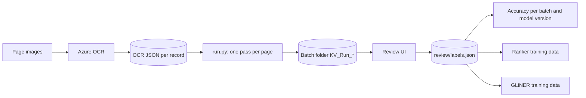
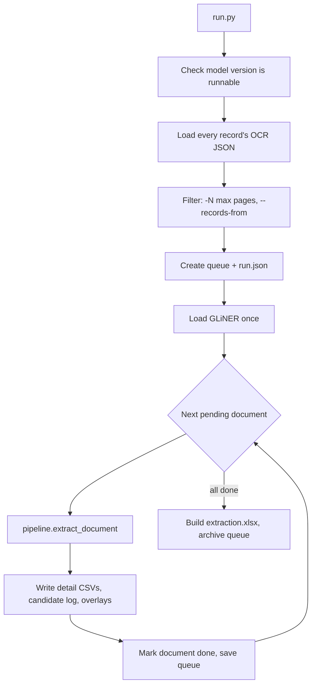
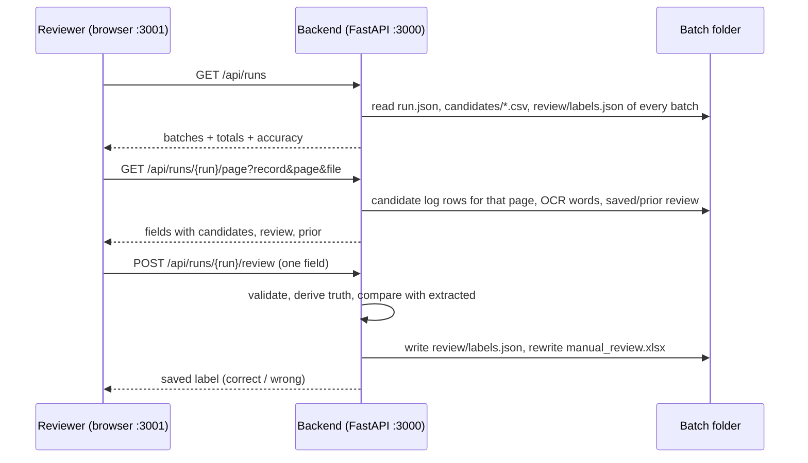

# How KV Extraction works

This document explains the whole KV Extraction system as it stands today:
what it extracts, what happens in the background, what the reviewer sees,
what gets saved, and why each piece was chosen.

## In one paragraph

Page images are OCRed once (Azure Document Intelligence), which gives every word on the
page with its position. `KV_Extraction/run.py` then reads each page, finds printed
labels ("keys") such as `DOB:`, `MRN`, `Patient Name`, `Electronically signed by`,
and reads the value next to each key using page geometry plus a small local NER model
(GLiNER low). Every possible value it considers ("candidate") is logged with its features;
the rules pick one per field. Each run is saved as a **batch** folder. In the web UI a
reviewer opens a batch, looks at the page image, the OCR text and the extracted values
side by side, ticks what is right, crosses what is wrong and adds what was missed.
Those reviews give the accuracy numbers, and they are the training data for the next
steps: a learned model that picks the right candidate, and a fine-tuned GLiNER.



---

## 1. What is extracted

Seven fields per page:

| Field | Example | Notes |
|---|---|---|
| Member DOB | `03/14/1957` | date of birth of the patient |
| Member ID | `E2694028`, `134-26-2945` | MRN, member ID, chart #, masked SSN with last 4 |
| Member Name | `Williams, David E` | the patient |
| Provider Name | `Burns, Lauren N MD` | treating / attending / billing provider |
| E-Signature | `Reilly, Thomas J MD` + `06/12/2024` | who signed the note, and the signature date |
| Date of Service | `06/12/2024` or `06/10/2024 - 06/12/2024` | single date or range |
| Page No | `Page 2 of 5` → `2/5` | printed page label |

Every field gets a value **per page**, and a **per record** (document) summary on top
(for example, the most common DOB across the record's pages).

**Headings** are found too (section 5.8): every section heading and title on the page, with a
level (Heading / Subheading), from the open-source Heron layout model. Headings are reviewed
like a field and collected as training data for our own heading classifier.

---

## 2. Setup and running

### Python

The repo runs on **Python 3.13** (`.python-version` has 3.13.15), always through the repo venv:

```powershell
py -3.13 -m venv .venv
.\.venv\Scripts\python.exe -m pip install -r requirements.txt
```

`requirements.txt` pins the exact package versions the rules and trained versions were built
and scored on. `KV_Extraction/Util/config.py` checks the interpreter (`Python_Version = (3, 13)`,
any 3.13.x) and stops any KV entry point started with a different version, because the `py`
launcher on this machine defaults to 3.14.

### Models (downloaded on first run)

`run.py` checks the models before anything runs (`Util/model_setup.py`). GLiNER and the Heron
heading detector are public Hugging Face models; when a folder under `Models_Root` is missing
or incomplete they are downloaded at the pinned revision in `config.Model_Sources` (the same
weights the rules were tuned on). Only model files come down; nothing is sent. A trained
version (`{Models_Root}/kv_ranker/vNNN`) is built here from reviews, so it cannot be
downloaded: copy it with the models folder, or run with `--model-version v0`.

| Folder under `Models_Root` | Source (pinned revision) |
|---|---|
| `gliner_low` | `urchade/gliner_small-v2.1`, plus the tokenizer of `microsoft/deberta-v3-small` in `encoder/` |
| `layout_heron` | `docling-project/docling-layout-heron` |
| `kv_ranker/vNNN` | trained locally (`Training/train.py`); copy it with the models folder |

### Paths (`KV_Extraction/Util/config.py`)

The config takes four absolute roots; everything else is derived from them.

| Root | This machine |
|---|---|
| `Raw_Input` | `E:\Projects\NER\Data\Raw` — page images: `{Raw_Input}/{RecordId}/{fileName}` |
| `OCR_Input` | `E:\Projects\NER\Data\OCR_Output` — OCR JSON: `{OCR_Input}/{RecordId}/*.json` (largest JSON in the folder is used) |
| `Output_Root` | `E:\Projects\NER\Data\Output` — everything the pipeline writes |
| `Models_Root` | `E:\Projects\NER\Models` — model folders (looked up here, downloaded when missing) |

Under `Output_Root` (created on the first run or when the Review UI starts):

| Setting | Folder | What lives there |
|---|---|---|
| `Run_Output` | `Runs/` | every batch `KV_Run_{timestamp}/` (with its `review/`) and the active `kv_run_queue.json` |
| `Training_Data` | `Training/` | datasets (`datasets/`), the test split (`splits/`), NER exports (`ner/`), optional `record_sources.csv` |
| `Rerun_Logs` | `Rerun_Logs/` | logs of reruns started from the Review UI |

Under `Models_Root`: `Ner_Model_Path` (`gliner_low`), `Heading_Models` (`layout_heron`; empty
dict = no headings) and `Model_Registry` (`kv_ranker`, trained versions `vNNN/`). A relative
root stops every entry point with an error.

### Moving to another system

Copy the code, the models folder (at least `kv_ranker/`) and the inputs (`OCR_Output` + `Raw`),
set the four roots in `config.py` to where they are on that machine, create the venv, install
`requirements.txt`, then run `run.py`: the output folders are created and the public models
download on the first run. The Output folder holds the reviews (`Runs/*/review/labels.json`);
copy it back to bring reviews home.

The layout model needs `torchvision` next to `torch` / `transformers` (all CPU).

### Commands

| What | Command (from repo root) |
|---|---|
| Create a batch | `.\.venv\Scripts\python.exe KV_Extraction\run.py --fresh` |
| Resume a stopped batch | `.\.venv\Scripts\python.exe KV_Extraction\run.py` |
| Only documents with N pages or fewer | `... run.py --fresh -N 20` |
| Only documents with more than M and at most N pages | `... run.py --fresh -N 5 10` (6 to 10 pages; same as `-M 5 -N 10`) |
| Rerun an earlier batch's documents | `... run.py --fresh --records-from KV_Run_20260927_130019 --model-version v0` |
| UI backend (port 3000) | `.\.venv\Scripts\python.exe -m uvicorn Review_UI.backend.app:app --app-dir KV_Extraction --host 127.0.0.1 --port 3000 --reload` |
| UI frontend (port 3001) | `cd KV_Extraction\Review_UI\frontend; npm run dev` → http://127.0.0.1:3001 |
| Export GLiNER training data | `.\.venv\Scripts\python.exe KV_Extraction\Training\ner_export.py` |
| Build a training dataset from all reviews | `.\.venv\Scripts\python.exe KV_Extraction\Training\dataset.py` |
| Train a new version (vNNN) | `.\.venv\Scripts\python.exe KV_Extraction\Training\train.py` |
| Compare v0 with a version | `.\.venv\Scripts\python.exe KV_Extraction\Training\evaluate.py --version v001 --split test` |
| Train on every record of a dataset | `.\.venv\Scripts\python.exe KV_Extraction\Training\train.py --dataset ds_train --split all` |
| Score a version on a separate test batch | `.\.venv\Scripts\python.exe KV_Extraction\Training\evaluate.py --dataset ds_test --split all --version v003` |
| Held-out accuracy (leave one document out) | `.\.venv\Scripts\python.exe KV_Extraction\Training\crossval.py --dataset ds_x` |
| Run a batch with a trained version | `... run.py --fresh --model-version v001` |

---

## 3. Input: what the OCR gives us

Azure Document Intelligence (Read model, `Azure_OCR/`) turns each page image into JSON.
The part the extraction uses, per page:

```json
{
  "fileName": "IMG_0325.PNG",
  "pageNumber": 1,
  "width": 1654, "height": 2339,
  "words": [
    {"content": "DOB:", "polygon": [69,34,138,34,138,64,69,64], "confidence": 0.989}
  ]
}
```

Every word has its text and its box on the page. Everything downstream works from these
words and boxes; the image itself is only used for overlays and in the UI.

---

## 4. Creating a batch: what `run.py` does



1. **Queue.** A new batch gets an id from the clock (`20260927_134848`) and a queue listing
   every document with its page count and status. The queue is saved to
   `{Run_Output}/kv_run_queue.json` and copied into the batch as `run.json` after every
   document, with progress, timings, the process id, the model version, the key catalog
   hash and the NER model.
2. **Resumable.** The document is the unit of work. Stop the run (Ctrl+C) and start it
   again without `--fresh`: finished documents are skipped, the rest are redone. A
   document's rows are replaced, never duplicated.
3. **GLiNER and the heading detectors are loaded once** before any page, fully offline. If
   one can't load, the run stops with the error instead of quietly finding nothing.
4. **Per document**: every page goes through the pipeline (section 5), then the results are
   written (section 6). One bad document is marked `error` and the run carries on.
5. **End**: `extraction.xlsx` is built from all detail CSVs, the status becomes `completed`
   (or `error` if any document failed), and the queue file is archived.

`--records-from RUN` takes the document list of an earlier batch, so a rerun covers exactly
the same documents. `--model-version` records which extraction model made the batch
(today only `v0`, the rules, can run).

---

## 5. What happens on each page (`pipeline.py`)

Each page is parsed **once**, its keys are found **once**, and all seven fields read that
same result.

### 5.1 Words and page size

OCR words become `Word(index, content, box)`. The index is the word's position in the OCR
JSON. It is stable, and the review UI and the training data refer to words by this index.

### 5.2 Finding keys (`Util/keys.py`)

Each field has a catalog of keys in `KV_Extraction/{Field}/keys.json` (for example
`Member_DOB/keys.json`: `DOB`, `Date of Birth`, `Birth Date`, ...). Provider designations
(`Physician`, `NP`, `Attending`, ...) are in `Provider_Name/roles.json`.

**One spot, one key.** Keys are matched longest first, so `Patient Name` wins over `Name`,
and a word used by one key can't be used by another. A shorter key is also skipped when a
longer key of the same field that contains it was found on the same line or the line just
above/below: `Provider` in "Admitting Provider" right under "Attending Provider" is not a
second key. OCR-variant keys (`Pro vider`, `D.O.B.`, `MAN`) never take a word spelled exactly
like another key of the field; that key takes it, so candidates show the key actually printed
(`Provider`, `DOB`, `MRN`, `Visit Note`). Four kinds of match:

| Match | Example |
|---|---|
| exact | `Date of Birth` |
| regex | `DOG` → DOB, `MAN`/`MEN`/`MRK` → MRN |
| lookalike | OCR swaps only: `D0B`, `55N`, `Narne` (rn→m), `Da te` (split word) |
| fuzzy | small edit distance: `Patlent #` → Patient #, `Pro vider` → Provider |

Context checks remove false keys: bare `Birth` followed by `Place/Order/Sex`, "age of
first birth", `Name` not capitalized or not preceded by Legal/Preferred/Patient/... (unless
it heads a table column: its line also has `DOB`, `Birth`, `Chart`, `MRN`, `ID`, `SSN`,
`Gender`, ...), `Chart` without `#`, fuzzy matches spread over two lines. Fuzzy matches are
also dropped when they sit in the middle of a whole line read as one OCR word (a sentence),
in a possessive ("patient's" ≠ `Patient ID`), when a short key is cut short (`D.O.` is a
credential, not `D.O.B.`), and for 3-letter ID keys unless printed in capitals (`MAN` → MRN,
never "Main"). An ID acronym key in lower case is prose ("2 times a day prn"). A two-word
DOS key may wrap: `(Collection` ending one line and `Date` starting the next.

**Key block list.** A field can have `KV_Extraction/{Field}/key_blocklist.json` listing, per
key, the words that make it prose rather than a label when they sit right before or right
after it:

```json
{"Patient": {"before": ["the", "per", "new"], "after": ["is", "has", "denies", "position"]}}
```

"The patient denies", "Patient has attempted", "Patient Position" are then not keys. Words
glued to the key inside one OCR token count too ("Patient-Reported"). A key followed by a
colon (`Patient:`) is never blocked. Matching ignores case and punctuation, and an entry
covers the key's OCR variants (`Provider` also blocks `Pro vider`, `Pro viler`) and OCR typos
glued to the next word ("Providier reviewed"). The list grows
from reviews (reason "Not a real key here", section 7.2) and can also be edited by hand; it
applies from the next run. On the current data it removed 26 of 51 `Patient` keys, all prose,
without changing any extracted value.

### 5.3 Trusting keys

A key found on the page isn't automatically trusted. The page is split into bands from
measured layouts (`Util/geometry.py`): **header** = top 28%, **footer** = bottom 20%,
everything else **mid**.

- Header/footer keys are trusted (`edge`).
- Mid-page keys are trusted only in a **cluster** of two or more keys close together
  (a demographics block), because a lone "Date" in the middle of a note is usually prose.
- Some keys are trusted alone: provider designations (`role_key`), multi-word
  service/admit/discharge DOS keys (`dos_strong_key`), multi-word e-signature phrases
  (`esig_phrase`).
- Weak keys (`Name`, `Patient`) need a strong key nearby. `Patient` needs a DOB/ID/name
  key within ±5% of the page height.
- An untrusted Member ID key still counts when it reads an ID a trusted key already read on
  the page (a lone mid-page `(MRN 20766549)` repeating the header's MRN).

Pages are phone screenshots of a document viewer, so the text often ends well above the
image bottom. Page No and the keyless DOB measure header/footer on the text's extent
(`edge_band`); keys keep the image bands, because on the text's extent print-stamp keys
(`Report Request ID`) would become trusted.

### 5.4 The value window

For each trusted key, a box is drawn around it where the value should be
(`Util/window.py`): wider for longer keys, mostly to the right and below. Each field has its
own shape. Member ID is wider and flatter, and names are shifted right. Designation keys
also look upward and across the full width. The words inside that box form the
**sentence** the field reads.

### 5.5 Reading each field

| Field | How the value is read | GLiNER labels |
|---|---|---|
| DOB | closest real calendar date to the key; every key gives a candidate, header/footer ones are preferred. If no key at all: a clear date in the header/footer that is at least 2 years before the page's other dates (10 years when the page has no other date). | `date`, `date of birth` |
| Member ID | closest ID-shaped token (has a digit, 3+ chars, not a phone or date, masked SSN only with last 4). A key in a table's header row (`Name  Patient ID  SSN`) reads the ID under it, never the next header; when the value row is one OCR word, the token under the key's centre. Keys only. | `ID`, `identifier` |
| Member Name | name right after the key, or the leftmost name in the key's column below. It stops at a line end, a digit, `(`, or another key. Last + First keys combine. Keyless: a name right beside a DOB/ID key in the header/footer (words of other lines read in between don't count), a running header (the name starting a header line with `Page N` and a date), or above a provider designation block. Provider names are rejected. | `person` |
| Provider Name | a person name, every word capitalized (particles like `van`, `de` excepted), with credentials allowed around it (MD, APRN, ...). A partial GLiNER name grows over the rest of `Last, First` (`Davis, Alfred H III, PA`, `Susoiu Tcaciuc, Daniela, MD`). A key after its value (`Allison Moosally, MD (Primary Provider)`, `Lauren N Burns, DO as PCP`) reads the same-line words before it. Profiles: standard, designation (needs an ID nearby, value usually above), `Bill Under` (header/footer only), `Progress Note` (needs a credential). | `person` |
| E-Signature | signer name as printed (up to the last credential), then the first date after it. | `person`, `date` |
| DOS | keys ranked by tier: service (incl. `Collection Date`, `Order Date`) > admit/discharge > weak (`Date`, `Report Date`, ...). A report date counts as a DOS, a print date doesn't (`DOS/key_blocklist.json` stops `Date` after "Print"/"Printed", `Encounter` in "Result Encounter Note"). The first date after the key on its line (the rest of the line is read even past the value window), a date wrapped onto the next line after `Key -` / `Key:`, else the column-aligned date below. Single dates or ranges. Admit and discharge on one page are both selected and become a range in the record summary. Year 2000..next year, never the DOB. Keyless header/footer dates as a fallback, skipping fax/print stamps. | none (pure rules) |
| Page No | `Page 2 of 5`, `PAGE: 002 OF 003`, `P.063/131`, bare `N of M` / `N/M`, only in header/footer (of the text's extent; a bare number only in the image's core bands). | none (pure rules) |

**Repeat mentions** (`Util/mentions.py`). Reviews label every place a patient's DOB or name
is written, so each accepted DOB / Name also gets keyless copies (key `Repeated Value`, never
selected) at its other occurrences on the page: dates in any format, names in either order.
A name inside a sentence ("Emma Young is a 73 year old") is prose and gets no copy. Member ID
has no copies: an ID repeated under its own key is read by that key.

### 5.6 What GLiNER does, and doesn't

GLiNER low reads the short key sentence (not the whole page) and tags spans such as
"person" or "date". The rules still decide the value. GLiNER is used to:

- **score** a value: when its span agrees with the rules' value, the GLiNER score is the
  candidate's score;
- **confirm names**: mid-page keyed names and keyless names need GLiNER support
  (score ≥ 0.5 when the name isn't right next to the key).

When GLiNER finds nothing, a value the rules found still gets a geometry score:
`0.92 − 0.12 × (words between key and value)`, never below 0.55. Keyless header/footer
dates get 0.7. Predictions are cached per sentence, so the same text is never run twice.

### 5.7 Picking the answer (selection)

Each field produces **candidates** (one per key/value it tried). Each is marked:

- `Accepted`: the value passed that field's checks;
- `Selected`: the value the rules chose for the page.

Selection today is hand-written. Header/footer beats mid. The most frequent value wins,
and region then score break ties. Member ID keeps one value per distinct key. Page No keeps
every valid label. DOS takes the best tier that has a valid date.

The **record summary** then takes the most common selected value across the record's
pages (highest score on a tie). DOS also lists every distinct DOS.

This selection step is what a trained version (`v001`, ...) replaces, field by field
(section 10.3). The rules keep finding candidates.

### 5.8 Headings (`Heading/extract.py`)

Headings come from the **page image**, not from keys. The open-source (Apache-2.0) layout
detector `docling-project/docling-layout-heron` (RT-DETRv2, IBM Docling) boxes the regions of
the page by class on CPU; its title, section_header and page_header boxes become candidates of
the field `heading_heron` (shown as **Headings**). PP-DocLayoutV3 was compared side by side on
the first batch and dropped: Heron found far more of the real headings.

For each heading box, the OCR words whose centres fall inside it are the heading text (so the
text is always the OCR's, and a picked heading has word positions). Boxes that cover the same
words are one candidate (higher score wins). Then the v0 rules, which a trained classifier
will replace:

| Rule | What it does |
|---|---|
| score | a box at 0.5 or above is a heading; 0.3–0.5 is shown to the reviewer as a near miss |
| common heading | a near miss (0.3–0.5, and no other reason to reject it) is accepted when its whole text is in `Heading/common_headings.txt` (`rule_note` = `common heading (low score)`). The list is never searched for on the page; it only verifies boxes the detector found. Matching ignores case, punctuation, plurals and `and / of / the`; keys of 6+ characters may differ by OCR or spelling slips (similarity ≥ 0.88), shorter ones (`HPI`, `Plan`) must match exactly |
| KV key | a box whose words are all a trusted KV key (`Patient:`, `DOB`, `Chief Complaint`) is not taken; keys are usually not headings, and the exceptions are learnt from reviews |
| page header | a page-header box needs two words of letters (a clock or a page number is not a running title) |
| inline label | `Assessment: stable, continue ...` keeps only `Assessment:`; a trailing qualifier is dropped (`Specialty Meds (Initial):` → `Specialty Meds`) |
| level | titles and page headers are **Heading**; a section header is **Heading** when it is clearly taller than the body text or in capitals, else **Subheading** |
| text label | a colon label outside every detector box (`HPI:`, `Family Hx:` mid-line; up to four capitalized words ending in `:`, not a trusted KV key) is added as a candidate of class `text_label`. v0 never takes it, not even when it is in the common list (on the reviewed pages that would add 4 right headings and 12 wrong ones, mostly specialty lists like `CARDIOLOGY:`); the reviewer can tick it and a trained version learns which ones are headings |

On the reviewed batch the common-heading rule took 13 more right headings and 3 wrong ones
(`Subjective:`, `Objective:`, `Plan:`, `Assessment:` boxes the detector was unsure of).

Every candidate goes into the same candidate log as the KV fields (section 6), with the
layout features a classifier needs: detector class and score, height against the body text,
how much of it is a KV key or a KV value, whole line or not, line count, ends with a colon,
where it starts on its line (line start / after a full stop / inline), how many words follow
it on the line, and how often the same text repeats in the record (running titles). The detector takes about
0.6–0.9 s per page.

---

## 6. What a batch saves

```
Data/Output/Runs/KV_Run_20260927_134848/
├── run.json                      batch summary: status, times, documents, model version, NER model
├── extraction.xlsx               "Extraction" (one row per page, all fields) + "Extraction Summary" (one row per record)
├── detail/
│   ├── DOB/extraction_dob.csv    one row per candidate: key, region, sentence, NER text, value, score, accepted, selected, source
│   ├── DOB/extraction_summary.csv  one row per record
│   ├── ID/ Name/ Provider/ ESig/ DOS/ PageNo/   same for every field
├── candidates/{RecordId}.csv     candidate log with ~60 features per candidate (training data)
├── overlays/
│   ├── dob/ member_id/ name/ ... per-field images with key boxes and value windows drawn
│   ├── overall/                  every field on one image
│   └── heading_heron/            heading boxes (level colour; near misses grey)
└── review/                       created by the first review (section 8)
    ├── labels.json
    └── manual_review.xlsx
```

### The candidate log

`candidates/{RecordId}.csv` records **every** candidate, not just the chosen one. Pages
where a field found nothing get a placeholder row, so misses can be counted. Main
column groups:

| Group | Examples |
|---|---|
| identity | run, model version, catalog hash, record, page, `ocr_sha1`, field, `candidate_id` |
| rule output | key, region, rule source, score, accepted, selected, value, normalized value |
| key | printed key text, match type, edit distance, why it was trusted, cluster size, key word indexes, key box |
| value location | value word indexes, value box, direction from key (right/below/...), word and line gaps |
| value shape | length, digit/alpha/upper ratios, has comma/initial, is a date |
| page and record context | keys on page, candidates for the field, how often the value repeats on the page and in the record |
| heading layout (heading fields) | height vs body text, KV key / value overlap and which field's key, whole line, line count, ends with a colon; `rule_note` says why a near miss was not taken |
| trained model (blank in a v0 batch) | `model_score` (probability), `model_selected`, `model_level`; what the batch selected is `model_selected` when filled, else `rule_selected` |

- `candidate_id` is a hash of record, page, field, key, key words, value and rule. It
  stays the same when the same page is extracted again, so reviews stay attached to it.
- `ocr_sha1` is a hash of the page's OCR text, so a review is only reused while the OCR is
  unchanged.

---

## 7. What the user sees

### 7.1 Home page (http://127.0.0.1:3001)

A **metric bar** across the top:

| Metric | Meaning |
|---|---|
| Total Runs | batch folders under `Run_Output` |
| Total Documents / Total Pages | summed over all batches |
| Avg Pages per Document | pages ÷ documents |
| Avg Time per Page | batch wall-clock time ÷ pages processed (includes overlays and writing) |
| Accuracy % | right ÷ (right + wrong + missed) key-value pairs, over every batch (from manual review) |

Below it, the **Batches** table: Run Name (with a status pill and "rerun of X" when it
is a rerun), Total Documents, Total Pages, Reviewed Pages, Current Accuracy, Model, Start
Time, Total Time, and three actions:

- **Review**: opens the batch review page.
- **Rerun**: a popup to pick the extraction model version. It runs the same documents into a
  new batch. Only runnable versions can be picked (today: `v0 · Rules`), and only one run
  can go at a time. The table refreshes every 5 seconds while it runs.
- **Detailed view**: a popup comparing accuracy per field and per heading detector for each
  model version, with a key-value subtotal and an all-modules total, over all batches that
  cover the same documents, plus the list of those batches.

Batches made before the candidate log existed show the model as `legacy`. They can be
rerun but not reviewed.

### 7.2 Batch review page

Four areas side by side:

1. **Files sidebar**: the batch's documents, each with "x / y pages reviewed".
2. **Image viewer**: the page image with tabs (raw, overall overlay, one tab per field),
   zoom and fit, a pager and a filmstrip. Fully reviewed pages are marked.
3. **OCR Data**: the page's OCR words line by line, with search. In pick mode, clicking a
   word selects it.
4. **Review**: one collapsible section per field, badged `To review`, `Pre-filled`,
   `Unsaved`, `Correct` or `Wrong`.

Reviewing one field on a page:

- Every candidate is listed with its key, value and whether the rules selected it: the
  selected ones first, then the ones **rejected by the rules** (always shown, greyed), so a
  right value the rules turned down can be ticked. Hovering a candidate outlines its key
  (orange) and value (blue) on the image.
- Mark each candidate **correct** (tick) or **incorrect** (cross). The values the rules
  selected must all be marked, and an incorrect selected value needs a **reason** ("Why is
  it wrong?" is only a prompt, not a choice). What each reason opens:

  | Reason | Opens |
  |---|---|
  | Wrong value (right key, wrong value) | a "Correct value (optional)" box right under it: value and value-word picking only; the candidate's key is kept |
  | Belongs to another field | a list of the other fields; pick the one it belongs to (required) |
  | Should not be selected (another key was right) | offered only for a selected value when the page has another key of the same field; a list of those keys (with the value each found) to pick the one that should have won (required) |
  | Not a value (label / noise) | nothing |
  | Not a real key here (prose / heading) | the block-word choice below |
  | Wrong key & value | nothing; enter the right value under "Missed values" |

- **Not a real key here**: for a candidate with a key, this reason shows the word before and
  the word after the key ("previous word *the*", "next word *denies*"). Tick the one that
  makes it prose; on save it goes into the field's `key_blocklist.json` (section 5.2), so the
  next run no longer treats "the Patient" / "Patient denies" as a key.
- **Add missed value**: when the right value isn't among the candidates, type it, or
  click "Pick value words" and click its words in the OCR panel or on the image. A click
  picks one word; Ctrl+click adds (or removes) more words, so multi-word values and keys
  ("Williams, David E", "Patient ID") can be picked. You can also pick the key words next
  to it. E-Signature also takes the signature date.
- **Member ID type**: Member ID stays one field, but every true ID is labelled **Member ID**,
  **MRN**, **SSN**, **Encounter number** or **Other ID** (accession, report numbers). A
  ticked ID shows an "ID type" choice pre-set from its key (`Member_ID/id_types.json`:
  `MRN:` → MRN, `Encounter#` → Encounter number, `Patient ID` → MRN, ...); an added ID takes
  its type from the key typed next to it, or must be picked when there is no key.
- **Not on this page**: when the field doesn't appear.
- Optional notes. The reviewer name is remembered in the browser.
- **Save** (per field). The next field opens automatically. When all fields of the page are
  done, a banner offers "Next page". **Clear review** removes the saved review.
- **Correct Page Sequence Number** (box under the reviewer name, its own Save): the page's
  correct position in the document, typed by the reviewer (a whole number of 1 or more; save
  it empty to remove it). It is only collected: no extractor detects it, and it is not part
  of any accuracy or training data. A value saved for the same page in another batch is
  pre-filled and needs one Save to keep it for this batch.

If the same page was already reviewed in another batch (same OCR text), a rerun is
**auto-reviewed**: the page counts as reviewed, its accuracy is computed from that review,
and the form is pre-filled with the review applied to the new candidates, judged the same
way as the accuracy (a candidate matching a true pair is ticked, any other extracted one is
crossed with "Wrong key & value" unless it kept its old verdict, and true pairs nothing
matched are listed as missed values). Saving it makes it this batch's own review.

**Headings.** Below the KV fields, under "Page structure", is one more section, **Headings**,
with its own image tab. It is reviewed the same way, with these differences:

- A ticked heading shows a **Level** choice (Heading / Subheading), pre-set to the model's
  guess. Near misses (low score, KV key, page-header noise) are listed below the detected ones.
- Reasons for a cross: **Not a heading (body text)**, **It's a KV key / field label**,
  **Noise (logo, clock, page number)**, and **Wrong text (cut off / too much)**, which opens a
  box for the right heading text and its level (like "Wrong value").
- **Add missed heading**: type it or pick its words, and choose its level.
- **No headings on this page** instead of "not on this page".

---

## 8. What happens in the background when you review



### Backend endpoints (`Review_UI/backend/app.py`)

| Endpoint | Purpose |
|---|---|
| `GET /api/runs` | all batches with status, totals, accuracy; metric bar totals |
| `GET /api/runs/{run}` | documents and pages of a batch, with how many fields are reviewed |
| `GET /api/runs/{run}/page` | one page: candidates per field, saved review, prior review from another batch |
| `GET /api/runs/{run}/page-ocr` | OCR lines and words (normalized boxes) for the OCR panel and picking |
| `GET /api/runs/{run}/image` | raw image or an overlay (falls back to `Raw_Input`) |
| `POST` / `DELETE /api/runs/{run}/review` | save / clear one field's review |
| `GET /api/versions` | extraction model versions (`Training/registry.py`) |
| `POST /api/runs/{run}/rerun` | start `run.py --fresh --records-from {run} --model-version V` in the background |
| `GET /api/runs/{run}/versions-accuracy` | accuracy per model version over the same documents |

- **Batch status** comes from `run.json`. A batch marked `running` whose process is gone
  shows as `stopped`.
- **Reruns** run as a separate process using the backend's own Python (the venv). Output
  goes to `{Rerun_Logs}/{time}_{run}_{version}.log`. If it fails within 3
  seconds, the UI shows the log tail.
- **Caching**: candidate logs, labels and accuracy are cached by file modification time, so
  the home page stays fast and updates as soon as something is saved.

### Saving a review (`Training/labels.py`)

1. The submission is checked against that page's candidates in the batch's candidate log.
   Every selected candidate must be judged, and incorrect ones need a reason. You can't mark
   "not on page" and add a value at the same time. You must either mark something correct,
   add a value, or mark it not on page.
2. Typed values must be valid for the field (a date that parses, an ID with letters/digits,
   a name, `2 of 5` for Page No).
3. **Truth** = candidates marked correct + added values.
4. **Correct?** = the set of normalized values the batch selected equals the set of
   normalized truth values. Nothing selected + "not on page" is correct.
5. Written to `review/labels.json` (atomic write), and `review/manual_review.xlsx` is
   rewritten (skipped if the workbook is open in Excel; `labels.json` is the record).
6. Block words ticked with "Not a real key here" are added to
   `{Field}/key_blocklist.json` (atomic write). A correction must point at a candidate
   marked "Wrong value" (or "Wrong text" for a heading) on the same field, and takes that
   candidate's key and key words. "Belongs to another field" must name a different KV field.
   "Should not be selected" needs a selected candidate and must name another candidate of
   the field whose key sits in a different spot. A correct or added heading must have a level.

### Normalization (why formatting differences don't count as errors)

| Field | Compared as |
|---|---|
| DOB | ISO date (`5/3/1957` = `05/03/1957` = `1957-05-03`) |
| DOS | `from\|to` ISO pair (a single date is its own range) |
| Member ID | uppercase letters and digits only (`134-26-2945` = `134262945`) |
| Names | lowercase words of 2+ letters, sorted; titles, suffixes, credentials removed (`Burns, Lauren N MD` = `Lauren Burns`) |
| Page No | `page/total` |
| Headings | lowercase words and digits (`CHIEF COMPLAINT:` = `Chief Complaint`) |

### Accuracy

- **Key-value pairs** are counted (`labels.score_pairs`). An extracted pair is every candidate
  the run accepted with a value (the model's call when a version is used), plus the selected
  one. It is **right** when it is one of the reviewed true pairs, **wrong** when its key or its
  value is wrong, and a true pair the run did not extract is **missed**. Accuracy = right ÷
  (right + wrong + missed). A candidate is the same pair as a true one when it is the ticked
  candidate itself, or has the same normalized value at the same words under the same key words.
  A field marked not on the page with nothing extracted counts as one right; a correction typed
  under a crossed value is the same error as that value, not a second miss. So a page with the
  DOB in the header and again next to `DOB:` mid-page has two true pairs, and finding only one
  scores 50%.
- **Headings** are counted the same way, one line per pair (`labels.heading_pairs`): a
  detected heading is **right** when its normalized text is a true heading and its level is
  right, **wrong** when it is no true heading or has the wrong level, and a true heading the
  run did not detect is **missed**. The detection details stay alongside: line-level
  **precision** (detected headings that are true), **recall** (true headings that were
  detected), **level accuracy** over the matched ones, and **pages exactly right**.
- **Overall accuracy adds up every extraction module**: the KV fields' pairs and the heading
  lines (`labels.evaluate_all`). The key-value subtotal is kept beside it (`kv`).
- **Per batch**: every page-field of the batch that has a review is scored. The review can
  come from **any** batch, with the latest review winning, as long as the page's OCR text
  (`ocr_sha1`) matches. This is why a rerun gets an accuracy number immediately. The
  Current Accuracy column is the all-modules number; its tooltip shows the key-value-only one.
- **Metric bar**: right ÷ (right + wrong + missed) summed over all batches, all modules.
- **Detailed view**: the same, grouped by model version (the latest batch of each): one row
  per KV field, a Key-value fields subtotal, one row per heading detector (hover for
  precision / recall / level), and **All modules**.
- `Training/evaluate.py` prints both totals: `KV overall` and `All modules`. The target is 95%.

---

## 9. What the review saves (`review/labels.json`)

One entry per page, one label per field:

```json
{
  "schema_version": 2,
  "pages": {
    "File1|1|IMG_0325.PNG": {
      "record_id": "File1", "page_number": "1", "file_name": "IMG_0325.PNG",
      "ocr_sha1": "3f9c1a...",
      "fields": {
        "member_id": {
          "not_present": false,
          "candidates": {
            "a1b2c3...": {"verdict": "incorrect", "reason": "wrong_field", "key": "SSN",
                          "value": "55N", "selected": true, "belongs_to": "",
                          "block_before": "", "block_after": ""}
          },
          "added": [
            {"value": "E2694028", "value_norm": "E2694028", "key": "Patient ID",
             "value_words": [22], "key_words": [13, 14], "for_candidate": "a1b2c3..."}
          ],
          "truth": [
            {"source": "added", "value": "E2694028", "value_norm": "E2694028",
             "value_words": [22], "key_words": [13, 14]}
          ],
          "extracted": [{"candidate_id": "a1b2c3...", "value": "55N"}],
          "correct": false,
          "notes": "", "reviewer": "Asha", "reviewed_at": "2026-09-27T08:12:40+00:00"
        }
      }
    }
  }
}
```

`manual_review.xlsx` holds the same data for people: **Field_Accuracy** (right / wrong /
missed pairs and accuracy per KV field, the key-value subtotal, per heading detector, and all
modules), **Heading_Accuracy** (precision / recall / level), **Page_Fields** (extracted vs
truth, with right / wrong / missed, per page-field),
**Candidates** (every verdict and reason, with BelongsTo, PreferKey, IdType, Level and BlockBefore/BlockAfter),
**Added** (missed values and corrections with word positions, ID type and level; ForCandidate links a
correction to the crossed candidate).

Reason codes: `wrong_value`, `wrong_field`, `other_selected`, `not_a_value`, `not_a_key`,
`wrong_key_value`; for headings `not_heading`, `is_key`, `wrong_span`, `noise`. `belongs_to`
(a field id) is filled only for `wrong_field`; `prefer_candidate` (the preferred candidate's
id) with `prefer_key`, `prefer_key_text` and `prefer_key_words` only for `other_selected`,
which is the training signal for which key should win when a page has several;
`block_before` / `block_after` only for `not_a_key`.
`for_candidate` is empty for a missed value and holds the `wrong_value` / `wrong_span`
candidate's id for a correction. `level` is filled for correct and added headings;
`id_type` (`member_id` / `mrn` / `ssn` / `encounter` / `other`) for correct and added Member IDs.

A heading label (`heading_heron`) has the same shape: each truth item is
a heading with its text, `value_words` (OCR word indexes) and `level`. Together with the
candidate log this is the training data for our own heading classifier: every detected box
with its layout features and a verdict, every missed heading with its words, the KV-key
exceptions ("It's a KV key" crosses vs ticked candidates noted "KV key"), and pages with no
headings.

A page entry can also hold `page_info` beside `fields`, which the reviewer fills in and
nothing detects: `{"page_sequence": 3, "reviewer": "...", "saved_at": "..."}` (the correct
page sequence number, `POST /api/runs/{id}/page-info`). The review workbook lists it on the
`Page_Info` sheet.

### Why these particular things are collected

| Collected | Used for |
|---|---|
| verdict on every candidate (not just the selected one) | ranker training: which candidate should have been picked |
| reason for wrong values | error analysis: finding vs choosing errors, OCR problems, wrong-field keys |
| missed values with their **word positions** | NER training spans; the gap between what exists and what the rules can find |
| the missed value's **key words** | mining new catalog keys ("Patient ID" wasn't in the catalog) |
| correction linked to the crossed candidate | pairs "what the rules picked" with "what they should have picked" for the ranker |
| block words for "not a real key" | the key block list: fewer false keys on the next run |
| not on page | true negatives: the model must learn to pick nothing |
| `ocr_sha1` | reusing labels across reruns, and flagging pages whose OCR changed |
| reviewer, time | provenance; the latest review wins |

---

## 10. How the collected data is used

### 10.1 Accuracy (now)

Accuracy on the home page, in the batch table and in the detailed view, as described above.

### 10.2 GLiNER fine-tuning data (now)

```powershell
.\.venv\Scripts\python.exe KV_Extraction\Training\ner_export.py            # all batches
.\.venv\Scripts\python.exe KV_Extraction\Training\ner_export.py KV_Run_...  # chosen batches
```

Writes `{Training_Data}/ner/gliner_train_{time}.json` in GLiNER's training format:

```json
[{"tokenized_text": ["Patient", "ID", ":", "E2694028", "DOB", ":", "03/14/1957"],
  "ner": [[3, 3, "member id"], [6, 6, "date of birth"]]}]
```

- Only pages where **all six NER fields** are reviewed are exported. Page No is left out.
  On those pages a word that isn't marked is known to be "not an entity".
- Tokens are the OCR words in reading order, cut into windows of up to 256 words at line
  breaks.
- Labels: `date of birth`, `patient name`, `provider name`, `signing provider`,
  `date of service`, and the Member ID split by ID type: `member id`,
  `medical record number`, `social security number`, `encounter number`, `other id`
  (reviews saved before the ID type take it from the key).
- Spans come from the word positions of correct candidates and picked missed values. Typed
  values without positions are located by their text.
- Every other occurrence of a true DOB, patient name, provider name or Member ID on the page
  is labelled too (dates in any format, names in either order), so a repeat isn't taught
  as "not an entity". Date of service and signing provider keep only the reviewed
  occurrence: the same date or name elsewhere may be a print date or a header name.
  Masked IDs and one-word names aren't spread.
- One span can carry two labels, e.g. `provider name` and `signing provider` for the
  provider who signed.
- A `.manifest.json` beside it gives the counts: pages exported, pages only partly
  reviewed, spans per label, extra occurrences labelled, values that couldn't be located, spans cut by a window
  boundary, and pages whose OCR changed since review.

### 10.3 Learned ranker and heading classifier (built; waiting for reviews)

The candidate log + reviews form a table of "candidate → right or wrong". All of it runs on
CPU (LightGBM), in seconds to minutes; no GPU is needed.

1. **Dataset** (`Training/dataset.py`) → `{Training_Data}/datasets/ds_{time}/`. Every
   reviewed page-field is a group of candidates. A candidate's label is its verdict when the
   reviewer gave one (so a right date read through a wrong key stays wrong), else whether it is
   one of the true key-value pairs (same value at the same words under the same key words). The
   newest batch with the same OCR supplies the candidates, so reruns don't duplicate pages. True
   pairs no candidate found are written to `misses.csv`: rules / catalog work, since a ranker
   only chooses among candidates.
2. **Train** (`Training/train.py`) → `{Models_Root}/kv_ranker/vNNN/`. One LightGBM model per
   field scores each candidate. Every KV candidate at or above the field's threshold is
   extracted (`model_accepted`, the pairs accuracy counts); a single-value field's record
   output is the best of them (`model_selected`), Member ID and headings take all of them.
   Headings also get a Heading / Subheading level model. Thresholds are tuned on out-of-fold
   scores grouped by record, maximizing key-value pair accuracy (headings: line F1). A field
   with fewer than 30 reviewed page-fields
   (`--min-groups`), or without both right and wrong candidates, gets no model and keeps the
   rules in that version.
   **Heading vocabulary**: the heading model also learns from the text. Its features include
   the match with `common_headings.txt` (`heading_common`) and how the same text was reviewed
   in *other* documents: in how many records it was a true heading and in how many a false
   one (`heading_vocab_true / _false / _rate`). A training row never counts its own record,
   and inside the threshold folds the vocabulary comes from the fit records only, so the
   model learns what the vocabulary is worth on unseen documents. The vocabulary is saved with
   the version (`vocab_heading_heron.json`, counts only): confirmed headings as text, texts
   never confirmed (which can be page content such as names) only as a hash and only when
   rejected in two or more records. Every reviewed batch grows it.
3. **Test split**: about 1 record in 5 is a test record, fixed by a hash of its id, so a
   record's pages are never split between training and testing and the split only grows
   (`{Training_Data}/splits/test_v1.txt`). When the test set is a separate batch, train with
   `train.py --split all` (every record of the dataset) and score the version on the test
   batch's own dataset with `evaluate.py --dataset ds_test --split all --version vNNN`.
4. **Evaluate** (`Training/evaluate.py`): v0 and the version on the same candidates, per
   field: key-value pair accuracy (as in the UI), precision, recall, false positives on pages
   without the field, and candidate recall (the ceiling any ranker can reach); headings: precision / recall and level
   accuracy. `train.py` writes the test-split result to the version's `metrics.json`.
   **Cross-validation** (`Training/crossval.py`): for every document, the models are trained
   on the other documents only and scored on it, so every page is scored once by a model that
   never saw its document. This is the honest number for new documents while the test split
   is empty; it is written to the dataset folder as `crossval.json`.
5. **Run it**: a trained version appears in the Rerun popup (or `run.py --model-version
   v001`). The rules find candidates as before, the version scores the candidate log, and its
   choices replace the rules' in the detail CSVs, workbook, record summaries and overlays; the
   Detailed view compares it with v0 on the same documents.

Fine-tuning GLiNER on the exported spans (section 10.2) is a later step that needs a GPU
(the RTX 3060 on this machine is enough) and far more reviewed pages than the ranker. The
promotion rule and phases are in `KV_Extraction/Training/PLAN.md`.

---

## 11. Why we use what we use

| Choice | Why |
|---|---|
| **Azure Document Intelligence OCR** | accurate words **with positions** on scanned chart pages; positions are what key/value reading depends on |
| **Keys + geometry rules** first | chart pages are forms: values sit next to printed labels. Rules work with zero training data, are explainable (every value has a key and a reason), and are easy to fix per layout |
| **Header/footer bands, clusters, trust rules** | the patient banner is almost always at the top or bottom; lone keys mid-page are mostly prose. Band sizes come from measured examples (`Data/examp`) |
| **Fuzzy / lookalike key matching** | OCR errors (`D0B`, `Patlent`, `55N`) would otherwise lose the key |
| **GLiNER low** (`urchade/gliner_small-v2.1`) | zero-shot NER: labels are plain words ("person", "date"), no training needed to start. Small enough for CPU, runs fully offline (patient data never leaves the machine). Chosen over medium for speed. Reads only short key sentences, which keeps it fast and precise |
| **GLiNER as support, not the decider** | NER alone confuses patients with providers and misses IDs. Combining it with keys and geometry gives both precision and a confidence score |
| **One pass per page** (`pipeline.py`) | parse and find keys once for all seven fields, so it's faster and every field sees the same keys (provider blocks feed the member name) |
| **Resumable queue per document** | long batches survive a crash or Ctrl+C without redoing finished documents |
| **Candidate log with features** | turns every run into training data; lets a model learn the selection the rules hand-code today |
| **Stable `candidate_id` and `ocr_sha1`** | reviews stay valid across reruns and model versions, so one review round scores every future version |
| **Review per candidate + missed values + not on page** | one review gives accuracy, ranker labels, NER spans and new keys at the same time |
| **Normalization before comparing** | `05/03/1957` vs `5/3/1957` or `Burns, Lauren MD` vs `Lauren Burns` are not errors |
| **CSV / JSON / XLSX in each batch folder** | agreed decision: no database, everything portable and readable in Excel, each batch self-contained |
| **FastAPI backend** | same language as the pipeline, so it reuses `labels.py`, `ocr.py` and `registry.py` directly |
| **React + Vite frontend** | small, fast dev server; typed API client shared by every screen |
| **Model registry with versions** | every batch records the version that made it; reruns and the Detailed view compare versions on the same documents |
| **Python 3.13 venv** | one known interpreter on every system; the version check stops accidental runs on 3.14 |
| **Heron for headings** | open-source (Apache-2.0), current document-layout detector that runs on CPU through `transformers` (no new runtime). It was reviewed side by side with PP-DocLayoutV3 on our own pages and kept; LayoutLMv3 (non-commercial licence) and DocLayout-YOLO (AGPL) were ruled out |
| **Headings as reviewable fields** | same candidate log, review flow, stable ids and scoring as the KV fields, so heading reviews become classifier training data with no separate tooling |

---

## 12. Known limits today

- `v002` is trained on the one fully reviewed batch (4 documents, 49 pages). None of the 4
  documents falls in the test split. On the pages it learned from it scores 97.9% (all
  modules, after five conflicting reviews were made consistent with their templates; v002 was
  trained before that fix); with each document held out (`crossval.py`) KV is 96.5% (rules alone 97.1%) and
  headings 62%, because heading choices depend on the template and each template is in one
  document only. A fair number needs new, reviewed documents. With the common-heading list and
  the heading vocabulary, the held-out numbers on the same 4 documents are headings 65.3%
  (rules alone 50.1%) and all modules 86.0% (rules alone 77.1%).
- The plan: run 300 documents, review them, train on all of them (`--split all`), then run and
  review a different 200 documents and score the version on those only.
- Runs are ordered by start time, but never before the run they reran
  (`Training/ner_export.run_started`), not by folder name: folder names are local clock times,
  and this machine's clock has jumped.
  `train.py` without `--dataset` takes the last `ds_*` folder by name, so pass `--dataset`
  after a clock change.
- **One run at a time** (the queue file is shared). The Rerun button refuses while a run is
  active.
- Batches made before the candidate log (`legacy`) can't be reviewed. Rerun them to review.
- `record_sources.csv` (which source system / layout each record comes from) isn't
  provided yet. The `source_system` feature is empty until it is.
- The UI shows key-value pair accuracy (right / wrong / missed on hover); precision / recall /
  candidate recall per field are in `evaluate.py` only.
- Headings are v0: detector boxes plus rules. The KV-key rule also turns down real headings
  that are keys too ("Chief Complaint", "Visit Note - August 1, 2024"); reviewers tick them,
  and the trained classifier is meant to learn these exceptions. On pages whose OCR words are
  whole lines (FIle4), a heading can only be a whole line.

---

## 13. File map

| Path | What it is |
|---|---|
| `KV_Extraction/run.py` | batch runner: queue, resume, outputs |
| `KV_Extraction/pipeline.py` | one-pass extraction of all fields per page |
| `KV_Extraction/Util/config.py` | paths, model sources and the Python version check |
| `KV_Extraction/Util/model_setup.py` | downloads missing public models before a run |
| `KV_Extraction/Util/keys.py` | key catalog loading, matching, trust rules |
| `KV_Extraction/Util/geometry.py` | words, boxes, header/footer bands, clusters |
| `KV_Extraction/Util/window.py` | value window shapes per field |
| `KV_Extraction/Util/model.py` | offline GLiNER loading and cached prediction |
| `KV_Extraction/Util/dates.py` | date finding and normalization |
| `KV_Extraction/Util/mentions.py` | where a value is written on the page; repeat mentions of DOB / Name |
| `KV_Extraction/Util/overlay.py` | overlay images |
| `KV_Extraction/Util/excel_out.py` | `extraction.xlsx` |
| `KV_Extraction/{Member_DOB,Member_ID,Member_Name,Provider_Name,Electronic_Signature,DOS,Page_No}/extract.py` | per-field rules; `keys.json` (and optional `key_blocklist.json`) beside them |
| `KV_Extraction/{field}/output.py` | per-field detail CSV columns and the record summary |
| `KV_Extraction/Util/documents.py` | loads the OCR JSON of every record under `OCR_Input` |
| `KV_Extraction/Heading/extract.py` | heading candidates from the Heron detector, v0 rules and levels |
| `KV_Extraction/Heading/common_headings.txt` | common headings, one per line: verifies low-score boxes and is a model feature |
| `Models/layout_heron/` | the Heron layout detector's weights |
| `KV_Extraction/Training/features.py` | candidate log and features |
| `KV_Extraction/Training/normalize.py` | value normalization per field |
| `KV_Extraction/Training/labels.py` | review labels, validation, pooled labels, accuracy, review workbook |
| `KV_Extraction/Training/ocr.py` | OCR words/lines for the UI and NER export |
| `KV_Extraction/Training/ner_export.py` | GLiNER training data export |
| `KV_Extraction/Training/dataset.py` | training dataset from candidate logs + reviews; test split |
| `KV_Extraction/Training/model.py` | trained version: features, scoring, selection (used by train, evaluate, run) |
| `KV_Extraction/Training/train.py` | trains a version `{Models_Root}/kv_ranker/vNNN/` |
| `KV_Extraction/Training/evaluate.py` | v0 vs a version on reviewed pages |
| `KV_Extraction/Training/crossval.py` | leave-one-document-out accuracy of a trained version |
| `KV_Extraction/Training/rules_check.py` | scores the current rules against the reviews in memory (no run written), `--show FIELD` lists wrong / missed pairs |
| `KV_Extraction/Member_ID/id_types.py`, `id_types.json` | Member ID type (Member ID / MRN / SSN / Encounter / Other) from the key |
| `KV_Extraction/Training/registry.py` | extraction model versions |
| `KV_Extraction/Training/PLAN.md` | the trainable-extraction plan and phases |
| `KV_Extraction/Review_UI/backend/app.py` | FastAPI backend |
| `KV_Extraction/Review_UI/frontend/src/` | React UI: `Home.tsx`, `BatchReview.tsx`, `ReviewPanel.tsx`, `OcrPanel.tsx` |
| `Azure_OCR/` | OCR of page images with Azure Document Intelligence |
