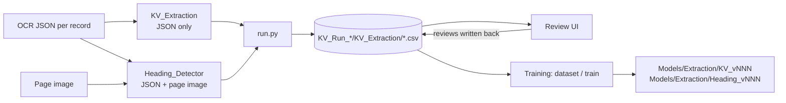

# How Extraction works

This document explains the whole system as it stands today: the two models, what a run saves,
what the reviewer does, and how the saved tables train the next version.

## In one paragraph

Page OCR (Azure, one JSON per record: every word with its position) is read by **two separate
models**. **KV_Extraction** finds printed labels ("keys") such as `DOB:`, `Acct#`, `Electronically
signed by` and reads the value next to each from page geometry plus a small local NER model
(GLiNER). It reads the OCR JSON only; it never opens the page image. **Heading_Detector** finds
section headings with a layout model on the page image and gives each the text of the OCR words
under it, so it needs both. `Extraction/run.py` runs both on every page and saves **one folder of CSV
tables per run**, `KV_Extraction\`, holding every candidate either model considered and the
sentence it was read from. In the Review UI a reviewer judges each extracted value; the reviews are
written into the same tables. Those tables are also the training data: the one folder that
has to move between machines.



---

## 1. What is extracted

Seven key-value fields per page, plus headings:

| Field (sheet) | Example | Notes |
|---|---|---|
| Member DOB (`Member_DOB`) | `03/14/1957` | date of birth of the patient |
| Member ID (`Member_ID`) | `E2694028`, `134-26-2945`, `48497` | MRN, member ID, chart #, account #, masked SSN with last 4. Which kind of ID it is comes from the key, never from the reviewer |
| Member Name (`Member_Name`) | `Williams, David E` | the patient |
| Provider Name (`Provider_Name`) | `Burns, Lauren N MD` | treating / attending / billing provider (the signer of an e-signature line is *not* a provider by itself) |
| E-Signature (`E_Sign`) | `Valerie Fuller, D.O. 02/21/2024` | **one value**: the signer and the signature date together |
| Date of Service (`DOS`) | `06/12/2024` or `06/10/2024 - 06/12/2024` | single date or range |
| Page No (`Page_No`) | `Page 2 of 5` → `2/5` | every printed page label (a page may carry several: fax header, chart header) |
| Headings (`Headings`) | `Exam:`, `Assessment #1:` | every section heading and title with a level (Heading / Subheading) |

Every field gets a value **per page**.

---

## 2. Setup and running

### Python

The repo runs on **Python 3.13** (`.python-version`), always through the repo venv:

```powershell
py -3.13 -m venv .venv
.\.venv\Scripts\python.exe -m pip install -r requirements.txt
```

`requirements.txt` pins the exact versions the rules were built on. `Extraction/Util/config.py`
checks the interpreter and stops any entry point started on a different 3.13-incompatible version.

### Models

`Models\` holds the two public base models and, in its own folder, the trained versions. `run.py`
checks the base models before anything runs and downloads a missing one at the pinned revision
(`config.Model_Sources`); only model files come down.

| Folder | What |
|---|---|
| `Models\gliner_low` | `urchade/gliner_small-v2.1` (+ the `microsoft/deberta-v3-small` tokenizer in `encoder\`): the NER base of KV_Extraction. Downloaded when missing |
| `Models\layout_heron` | `docling-project/docling-layout-heron`: finds headings on the image. Downloaded when missing |
| `Models\Extraction\KV_vNNN` | trained key-value version (ranks the rules' candidates), built locally |
| `Models\Extraction\Heading_vNNN` | trained heading version, built locally |
| `Models\_retired\` | versions trained before this layout (screenshots): kept, never loaded |

**`Models\Extraction` is committed to git** (the two base models and `_retired` are ignored), so a trained
version travels to another machine with a pull. A version `vNNN` can exist for either model or both;
a run with `--model-version vNNN` loads whichever exist and keeps the rules for the other. `v0` is the
rules and needs nothing. The version a run uses without `--model-version` is
`config.Default_Model_Version`.

### Paths (`Extraction/Util/config.py`)

Every path is a full absolute path set in `config.py` and nowhere else; the rest of the code reads
them from it (the output folders under `Output_Root` are derived).

| Setting | What lives there |
|---|---|
| `Raw_Input` | page images `{RecordId}/{fileName}`: read by the heading model and shown in the Review UI |
| `OCR_Input` | OCR JSON `{RecordId}/*.json`: the input of both models |
| `Output_Root` | everything the pipeline writes: `Runs/` (one `KV_Run_{timestamp}/` per run), `Training/`, `Rerun_Logs/` |
| `Ner_Model_Path`, `Heading_Models`, `Extraction_Models`, `Retired_Models` | the model folders above |

### Commands (from the repo root, with the repo `.venv`)

| Task | Command |
|---|---|
| New run over every document | `.\.venv\Scripts\python.exe Extraction\run.py --fresh` |
| Only documents with N pages or fewer | `... Extraction\run.py --fresh -N 5` |
| Resume a stopped run | `... Extraction\run.py` |
| Run a trained version | `... Extraction\run.py --fresh --model-version v003` |
| Rerun the documents of an earlier run | `... Extraction\run.py --fresh --records-from KV_Run_... --model-version v003` |
| UI backend (port 3000) | `.\.venv\Scripts\python.exe -m uvicorn Review_UI.backend.app:app --app-dir Extraction --host 127.0.0.1 --port 3000 --reload` |
| UI frontend (port 3001) | `cd Extraction\Review_UI\frontend; npm run dev` → http://127.0.0.1:3001 |
| Build a training dataset from every reviewed run | `... Extraction\Training\dataset.py` |
| Train a new version (`--model kv`, `heading` or `both`) | `... Extraction\Training\train.py --model both` |
| Compare v0 with a version | `... Extraction\Training\evaluate.py --version v003 --split test` |
| Held-out accuracy (leave one document out) | `... Extraction\Training\crossval.py --dataset ds_x` |
| Try rule changes against the reviews without a run | `... Extraction\Training\rules_check.py --show FIELD` |
| Selected values of two runs side by side | `... Extraction\Training\diff_runs.py KV_Run_A KV_Run_B` |
| GLiNER fine-tuning data | `... Extraction\Training\ner_export.py` |

---

## 3. Input: what the OCR gives us

Azure Document Intelligence (Read model, `Azure_OCR/`) turns each page image into JSON.
The part the extraction uses, per page:

```json
{
  "fileName": "IMG_0325.PNG",
  "pageNumber": 1,
  "width": 1654, "height": 2339,
  "words": [
    {"content": "DOB:", "polygon": [69,34,138,34,138,64,69,64], "confidence": 0.989}
  ]
}
```

Every word has its text and its box on the page. The key-value model works from these words
and boxes alone and never opens the image; only the heading model and the Review UI do.


---

## 4. A run: what `run.py` does

1. **Queue.** The record folders under `Raw_Input` (each holding that record's page images) decide
   which records exist; every one is looked up by name in `OCR_Input` (case-insensitive) and the run
   starts on the records that have OCR JSON. A record with no usable OCR (no folder, no JSON, or no
   pages) is not queued but is listed under `no_ocr` in `run.json`, logged as a warning and printed at
   the end; an OCR folder with no raw folder is ignored. A run gets an id from the clock and a queue
   listing every document with its page count and status, saved to `{Run_Output}/kv_run_queue.json`
   and copied into the run as `run.json`. `-N`, `-M` and `--records-from` choose the documents (the
   page count is the OCR's, or the number of images for a record without OCR).
2. **Models load once** (GLiNER, the heading detector, and the trained versions if asked), fully
   offline. If one can't load the run stops with the error instead of quietly finding nothing.
3. **Per document**, every page goes through `pipeline.extract_document`: KV_Extraction first
   (JSON only), then Heading_Detector (JSON + page image). The candidates become rows for the nine
   sheets of the tables; with a trained version its models set the `accepted` / `selected`
   columns, and the rules' own choice stays in `rule_accepted` / `rule_selected`.
4. **The tables are written** (every sheet's CSV, atomically) at most every 20 seconds and when the run
   ends. A document counts as completed only once written tables hold it, so stopping a run
   (Ctrl+C) and starting it again without `--fresh` skips what is saved and redoes the rest.
5. **That is all a run saves**: `run.json` and the `KV_Extraction\` tables. No overlay images, no
   per-field CSVs, no candidate folders.

---

## 5. What happens on each page (`pipeline.py`)

Each page is parsed **once**, its keys are found **once**, and all seven fields read that
same result.

### 5.1 Words and page size

OCR words become `Word(index, content, box)`. The index is the word's position in the OCR
JSON. It is stable, and the review UI and the training data refer to words by this index.

### 5.2 Finding keys (`Util/keys.py`)

Each field has a catalog of keys in `Extraction/{Field}/keys.json` (for example
`Member_DOB/keys.json`: `DOB`, `Date of Birth`, `Birth Date`, ...). Provider designations
(`Physician`, `NP`, `Attending`, ...) are in `Provider_Name/roles.json`.

**One spot, one key.** Keys are matched longest first, so `Patient Name` wins over `Name`,
and a word used by one key can't be used by another. A shorter key is also skipped when a
longer key of the same field that contains it was found on the same line or the line just
above/below: `Provider` in "Admitting Provider" right under "Attending Provider" is not a
second key. OCR-variant keys (`Pro vider`, `D.O.B.`, `MAN`) never take a word spelled exactly
like another key of the field; that key takes it, so candidates show the key actually printed
(`Provider`, `DOB`, `MRN`, `Visit Note`). Four kinds of match:

| Match | Example |
|---|---|
| exact | `Date of Birth` |
| regex | `DOG` → DOB, `MAN`/`MEN`/`MRK` → MRN |
| lookalike | OCR swaps only: `D0B`, `55N`, `Narne` (rn→m), `Da te` (split word) |
| fuzzy | small edit distance: `Patlent #` → Patient #, `Pro vider` → Provider |

Context checks remove false keys: bare `Birth` followed by `Place/Order/Sex`, "age of
first birth", `Name` not capitalized or not preceded by Legal/Preferred/Patient/... (unless
it heads a table column: its line also has `DOB`, `Birth`, `Chart`, `MRN`, `ID`, `SSN`,
`Gender`, ...), `Chart` without `#`, fuzzy matches spread over two lines. Fuzzy matches are
also dropped when they sit in the middle of a whole line read as one OCR word (a sentence),
in a possessive ("patient's" ≠ `Patient ID`), when a short key is cut short (`D.O.` is a
credential, not `D.O.B.`), and for 3-letter ID keys unless printed in capitals (`MAN` → MRN,
never "Main"). An ID acronym key in lower case is prose ("2 times a day prn"). A two-word
DOS key may wrap: `(Collection` ending one line and `Date` starting the next.

**Key block list.** A field can have `Extraction/{Field}/key_blocklist.json` listing, per
key, the words that make it prose rather than a label when they sit right before or right
after it:

```json
{"Patient": {"before": ["the", "per", "new"], "after": ["is", "has", "denies", "position"]}}
```

"The patient denies", "Patient has attempted", "Patient Position" are then not keys. Words
glued to the key inside one OCR token count too ("Patient-Reported"). A key followed by a
colon (`Patient:`) is never blocked. Matching ignores case and punctuation, and an entry
covers the key's OCR variants (`Provider` also blocks `Pro vider`, `Pro viler`) and OCR typos
glued to the next word ("Providier reviewed"). The list grows
from reviews (reason "Not a real key here", section 7.2) and can also be edited by hand; it
applies from the next run. On the current data it removed 26 of 51 `Patient` keys, all prose,
without changing any extracted value.

### 5.3 Trusting keys

A key found on the page isn't automatically trusted. The page is split into bands from
measured layouts (`Util/geometry.py`): **header** = top 28%, **footer** = bottom 20%,
everything else **mid**.

- Header/footer keys are trusted (`edge`).
- Mid-page keys are trusted only in a **cluster** of two or more keys close together
  (a demographics block), because a lone "Date" in the middle of a note is usually prose.
- Some keys are trusted alone: provider designations (`role_key`), multi-word
  service/admit/discharge DOS keys (`dos_strong_key`), multi-word e-signature phrases
  (`esig_phrase`).
- Weak keys (`Name`, `Patient`) need a strong key nearby. `Patient` needs a DOB/ID/name
  key within ±5% of the page height.
- An untrusted Member ID key still counts when it reads an ID a trusted key already read on
  the page (a lone mid-page `(MRN 20766549)` repeating the header's MRN).

Pages are phone screenshots of a document viewer, so the text often ends well above the
image bottom. Page No and the keyless DOB measure header/footer on the text's extent
(`edge_band`); keys keep the image bands, because on the text's extent print-stamp keys
(`Report Request ID`) would become trusted.

### 5.4 The value window

For each trusted key, a box is drawn around it where the value should be
(`Util/window.py`): wider for longer keys, mostly to the right and below. Each field has its
own shape. Member ID is wider and flatter, and names are shifted right. Designation keys
also look upward and across the full width. The words inside that box form the
**sentence** the field reads.

### 5.5 Reading each field

| Field | How the value is read | GLiNER labels |
|---|---|---|
| DOB | closest real calendar date to the key; every key gives a candidate, header/footer ones are preferred. If no key at all: a clear date in the header/footer that is at least 2 years before the page's other dates (10 years when the page has no other date). | `date`, `date of birth` |
| Member ID | closest ID-shaped token (has a digit, 3+ chars, not a phone or date, masked SSN only with last 4). A key in a table's header row (`Name  Patient ID  SSN`) reads the ID under it, never the next header; when the value row is one OCR word, the token under the key's centre. Keys only. | `ID`, `identifier` |
| Member Name | name right after the key, or the leftmost name in the key's column below. It stops at a line end, a digit, `(`, or another key. Last + First keys combine. Keyless: a name right beside a DOB/ID key in the header/footer (words of other lines read in between don't count), a running header (the name starting a header line with `Page N` and a date), or above a provider designation block. Provider names are rejected. | `person` |
| Provider Name | a person name, every word capitalized (particles like `van`, `de` excepted), with credentials allowed around it (MD, APRN, ...). A partial GLiNER name grows over the rest of `Last, First` (`Davis, Alfred H III, PA`, `Susoiu Tcaciuc, Daniela, MD`). A key after its value (`Allison Moosally, MD (Primary Provider)`, `Lauren N Burns, DO as PCP`) reads the same-line words before it. Profiles: standard, designation (needs an ID nearby, value usually above), `Bill Under` (header/footer only), `Progress Note` (needs a credential). | `person` |
| E-Signature | signer name as printed (up to the last credential), then the first date after it. | `person`, `date` |
| DOS | keys ranked by tier: service (incl. `Collection Date`, `Order Date`) > admit/discharge > weak (`Date`, `Report Date`, ...). A report date counts as a DOS, a print date doesn't (`DOS/key_blocklist.json` stops `Date` after "Print"/"Printed", `Encounter` in "Result Encounter Note"). The first date after the key on its line (the rest of the line is read even past the value window), a date wrapped onto the next line after `Key -` / `Key:`, else the column-aligned date below. Single dates or ranges. Admit and discharge on one page are both selected and become a range in the record summary. Year 2000..next year, never the DOB. Keyless header/footer dates as a fallback, skipping fax/print stamps. | none (pure rules) |
| Page No | `Page 2 of 5`, `PAGE: 002 OF 003`, `P.063/131`, bare `N of M` / `N/M`, only in header/footer (of the text's extent; a bare number only in the image's core bands). | none (pure rules) |

**Repeat mentions** (`Util/mentions.py`). Reviews label every place a patient's DOB or name
is written, so each accepted DOB / Name also gets keyless copies (key `Repeated Value`, never
selected) at its other occurrences on the page: dates in any format, names in either order.
A name inside a sentence ("Emma Young is a 73 year old") is prose and gets no copy. Member ID
has no copies: an ID repeated under its own key is read by that key.

### 5.6 What GLiNER does, and doesn't

GLiNER low reads the short key sentence (not the whole page) and tags spans such as
"person" or "date". The rules still decide the value. GLiNER is used to:

- **score** a value: when its span agrees with the rules' value, the GLiNER score is the
  candidate's score;
- **confirm names**: mid-page keyed names and keyless names need GLiNER support
  (score ≥ 0.5 when the name isn't right next to the key).

When GLiNER finds nothing, a value the rules found still gets a geometry score:
`0.92 − 0.12 × (words between key and value)`, never below 0.55. Keyless header/footer
dates get 0.7. Predictions are cached per sentence, so the same text is never run twice.

### 5.7 Picking the answer (selection)

Each field produces **candidates** (one per key/value it tried). Each is marked:

- `Accepted`: the value passed that field's checks;
- `Selected`: the value the rules chose for the page.

Selection today is hand-written. Header/footer beats mid. The most frequent value wins,
and region then score break ties. Member ID keeps one value per distinct key. Page No keeps
every valid label. DOS takes the best tier that has a valid date.

The **record summary** then takes the most common selected value across the record's
pages (highest score on a tie). DOS also lists every distinct DOS.

This selection step is what a trained version (`v001`, ...) replaces, field by field
(section 10.3). The rules keep finding candidates.

### 5.8 Headings (`Heading/extract.py`)

Headings come from the **page image**, not from keys. The open-source (Apache-2.0) layout
detector `docling-project/docling-layout-heron` (RT-DETRv2, IBM Docling) boxes the regions of
the page by class on CPU; its title, section_header and page_header boxes become candidates of
the field `heading_heron` (shown as **Headings**). PP-DocLayoutV3 was compared side by side on
the first batch and dropped: Heron found far more of the real headings.

For each heading box, the OCR words whose centres fall inside it are the heading text (so the
text is always the OCR's, and a picked heading has word positions). Boxes that cover the same
words are one candidate (higher score wins). Then the v0 rules, which a trained classifier
will replace:

| Rule | What it does |
|---|---|
| score | a box at 0.5 or above is a heading; 0.3–0.5 is shown to the reviewer as a near miss |
| common heading | a near miss (0.3–0.5, and no other reason to reject it) is accepted when its whole text is in `Heading/common_headings.txt` (`rule_note` = `common heading (low score)`). The list is never searched for on the page; it only verifies boxes the detector found. Matching ignores case, punctuation, plurals and `and / of / the`; keys of 6+ characters may differ by OCR or spelling slips (similarity ≥ 0.88), shorter ones (`HPI`, `Plan`) must match exactly |
| KV key | a box whose words are all a trusted KV key (`Patient:`, `DOB`, `Chief Complaint`) is not taken; keys are usually not headings, and the exceptions are learnt from reviews |
| page header | a page-header box needs two words of letters (a clock or a page number is not a running title) |
| inline label | `Assessment: stable, continue ...` keeps only `Assessment:`; a trailing qualifier is dropped (`Specialty Meds (Initial):` → `Specialty Meds`) |
| level | titles and page headers are **Heading**; a section header is **Heading** when it is clearly taller than the body text or in capitals, else **Subheading** |
| text label | a colon label outside every detector box (`HPI:`, `Family Hx:` mid-line; up to four capitalized words ending in `:`, not a trusted KV key) is added as a candidate of class `text_label`. v0 never takes it, not even when it is in the common list (on the reviewed pages that would add 4 right headings and 12 wrong ones, mostly specialty lists like `CARDIOLOGY:`); the reviewer can tick it and a trained version learns which ones are headings |

On the reviewed batch the common-heading rule took 13 more right headings and 3 wrong ones
(`Subjective:`, `Objective:`, `Plan:`, `Assessment:` boxes the detector was unsure of).

Every candidate goes into the same candidate log as the KV fields (section 6), with the
layout features a classifier needs: detector class and score, height against the body text,
how much of it is a KV key or a KV value, whole line or not, line count, ends with a colon,
where it starts on its line (line start / after a full stop / inline), how many words follow
it on the line, and how often the same text repeats in the record (running titles). The detector takes about
0.6–0.9 s per page.

---


Two generic rules stop things that are the page's data from being taken as headings:
a heading made mostly of words the KV model read (`Benjamin Nicole`, `DOB 12/17/1965`,
`Page 3 of 5`) is rejected ("KV key / value"), and a page header whose text repeats on more than
one page of the document (a fax line, a letterhead) is a "running header". Short colon labels the
layout model did not box (`Care Plan:`, `Assessment #1:`) are logged as candidates for the trained
heading model to decide.

---

## 6. What a run saves: the `KV_Extraction\` tables

One folder of CSV tables per run, `{Run_Output}/KV_Run_{id}/KV_Extraction/`, one file per sheet: `Member_Name`, `Member_ID`,
`Member_DOB`, `Provider_Name`, `E_Sign`, `DOS`, `Page_No`, `Headings`, `Overall`.

**`Overall`** has one row per page with the final selected value of every field:
`RecordId, PageCount, FileName, PageNumber, Member_Name, Member_ID, Member_DOB, Provider_Name,
E_Sign, DOS, Page_No, Headings`.

**Every other sheet has one row per candidate** (a value some rule or model considered, accepted
or not, plus a placeholder row where a field found nothing, so misses can be counted):

| Columns | Meaning |
|---|---|
| `run_id, model_version, record_id, file_name, page_number` | which run, which page |
| `key` (`keyless` if none), `value`, `value_norm`, `region`, `source`, `confidence` | what was found and how |
| `accepted`, `selected` | what the run extracted / chose for the page (the trained model's call when it made one, else the rules') |
| `sentence` | JSON: the words the candidate was read from. From 4 words before the key through the value to 4 words after (or around the value alone for a keyless one), in OCR order, with every word's box: `{"text": "...", "words": [{"i": OCR index, "t": text, "b": [x0,y0,x1,y1] (0..1 of the page), "r": "key"/"value"/""}]}` |
| `accuracy` and `review_reason, belongs_to, review_level, for_candidate, reviewer, reviewed_at` | the reviewer's side (below); blank until reviewed |
| `ner_text` | what GLiNER returned |
| everything else | the candidate's features (key match and trust, key and value boxes, key to value relation and gaps, value shape, page and record context, `candidate_id`, `ocr_sha1`, `catalog_hash`); `heading_*` layout features on `Headings` only; `model_*` filled by a trained version |

The sentence plus the box of every word is a self-contained snapshot of the candidate: the
page, the image and the full OCR are not needed to train on it.

### What the reviewer's columns hold

- `accuracy` is `right` or `wrong` on a candidate the run extracted. Rows the reviewer adds have
  `source = review` and `accuracy = missed` (a true value the run did not extract) or `fixed` (the
  words picked for a wrong candidate, `for_candidate`). Blank means not reviewed.
- `reviewed_at` is stamped on every row of a reviewed page-field. A reviewed page-field with
  nothing right and nothing picked means the field is not on the page.
- A review row keeps the sentence built from the words the reviewer selected, exactly like a
  candidate's.

---

## 7. What the user sees (Review UI)

### 7.1 Home page (http://127.0.0.1:3001)

Metrics bar: total batches (distinct sets of documents), total runs, total documents, total pages,
avg pages / document, avg time / page, latest model accuracy (KV and headings, over the documents
reviewed). Table: Run Name, Total Documents, Total Pages, Reviewed Pages, Current KV_Accuracy,
Current H_Accuracy, Model, Start Time, Total Time, Actions (review, rerun with another version).
Only runs that have a `KV_Extraction` tables folder are listed.

### 7.2 Batch review page

Top bar: `Model version vNNN · Accuracy: KV_Extraction - N.NN% (NN right · NN wrong · NN missed),
Heading - P N.NN% R N.NN% (NN right · NN wrong · NN missed)`. Three panels: the **original page
image** (the only picture; zoom, page strip), the **OCR text**, and the **review**, one section per
field. The sentence and the other collected data are never shown.

For each value the run extracted the reviewer ticks it or crosses it:

- **Key-value fields**, wrong because: *Wrong Value*, *Wrong Key & Value*, *Key Belongs to Another
  Group* (then which group), *Wrong Position*. For the first, second and fourth the reviewer may
  select the right value (and, for the second and fourth, the right key) on the OCR.
- **Headings**, wrong because: *Noise* or *Not a Heading/Sub Heading*. A correct heading carries its level.
- A value the run missed is added with **Add missed value**.

Anything the reviewer selects has to be on the OCR (click words on the image or in the OCR text;
Ctrl+click adds more): nothing is typed, and what is selected may be wrong or oddly formatted.
For an e-signature the reviewer selects the whole value in one go (name and date).

---

## 8. What happens when you review

- The backend holds the run's tables in memory (`Training/labels.py` `RunStore`). A review is
  written onto the rows, and a single writer thread saves just the CSV of the sheet that changed a
  fraction of a second later (atomic, so a crash never leaves half a file). If another program has
  that file open the save waits and retries every few seconds and the UI shows a banner; nothing is
  lost while the backend runs.
- What a run extracted does not change when it is reviewed, so the backend reads and indexes it once when
  the run is loaded; a review edits only its own page-field's rows, label and score, so a save and the
  refresh after it take tens of milliseconds even on a run of hundreds of documents.
- Accuracy counts key-value pairs: an extracted pair is **right** when a true pair has the same key
  and value (the same candidate, or the same words under the same key words); an extracted pair
  with a wrong key or value is **wrong**; a true pair the run did not extract is **missed**.
  Accuracy = right / (right + wrong + missed). A field not on the page with nothing extracted is one
  right. Values are compared in a normal form (`5/3/2024` = `05/03/2024`, `Burns, Lauren N MD` =
  `Lauren Burns`; a signature is the name words plus the ISO date), so formatting is not an error.
- Headings are scored the same way as pairs for the summary (right = text and level right), and
  also as line-level precision and recall.
- Reviews are tied to the OCR text by `ocr_sha1`, so a rerun over the same pages is scored with the
  same reviews; another run's review pre-fills a page not yet reviewed in this one.

---

## 9. Training

Training reads the tables only (the sentence, the boxes and the features are in them); it needs
neither the images nor the OCR.

1. `Training/dataset.py` joins every reviewed run's candidates with its reviews into one
   labelled snapshot (`Output/Training/datasets/ds_*`). A candidate's label is the reviewer's verdict,
   else whether it matches a true pair; true pairs no candidate matches are "generator misses" (a rules
   job, since a ranker only chooses among candidates). About 1 record in 5 is a test record, fixed by id.
2. `Training/train.py --model both` trains **separately** the KV_Extraction ranker (one LightGBM per
   field, from the numeric and categorical features in `Training/model.py`) and the Heading_Detector
   ranker (plus a Heading / Subheading level model and a heading vocabulary), each into its own
   registry under one new version number (`Training/registry.next_version`). A field with too few
   reviewed page-fields, or without both true and false candidates, keeps the rules.
3. `Training/evaluate.py` scores v0 against a version on the same candidates; `crossval.py` scores
   it on documents it never saw.
4. The rules still generate every candidate; a model only picks among them. A candidate nobody
   generated can only be fixed in the rules (`Training/rules_check.py` tries a rule change against
   the reviews in memory).

The sentences collected around every key and value are also the input for fine-tuning an NER model
(`ner_export.py` builds GLiNER data from reviewed pages today) and, with the images, a layout model.

---

## 10. Known limits today

- A trained model needs enough reviews: with a handful of pages every KV candidate is right and
  there is nothing to learn from. Accuracy on a few pages says little about other documents.
- The reviewer's convention matters: e.g. the signer of an e-signature line is not a Provider Name
  unless the page names a provider; headings are section labels, not exam sub-fields.
- Headings need the image; recall on short colon labels comes from the trained heading model.
- Runs made before this layout (per-field CSVs, overlays, `labels.json`) are not listed or reviewable.
- Two Review UI processes on the same run would overwrite each other's tables.

---

## 11. File map

| File | What it does |
|---|---|
| `Extraction/run.py` | run queue, resume, and writing the tables |
| `Extraction/pipeline.py` | both models on a page (`extract_page_kv`, `extract_page_headings`) |
| `Extraction/Util/config.py` | paths, model folders and sources, the Python version check |
| `Extraction/Util/model_setup.py` | downloads missing public models before a run |
| `Extraction/Util/tables.py` | reads and writes the CSV tables (atomic, one sheet at a time) |
| `Extraction/Util/keys.py`, `geometry.py`, `window.py`, `model.py`, `dates.py`, `mentions.py`, `tokens.py` | key catalog and matching, words and boxes, value windows, GLiNER, dates, repeated mentions |
| `Extraction/{Member_DOB,Member_ID,Member_Name,Provider_Name,Electronic_Signature,DOS,Page_No}/extract.py` | per-field rules; `keys.json` beside them |
| `Extraction/Heading/extract.py` | heading candidates from the Heron detector, rules and levels |
| `Extraction/Training/features.py` | candidate columns, the table layout, the sentence builder |
| `Extraction/Training/labels.py` | reviews in the tables (`RunStore`), scoring, pooled labels |
| `Extraction/Training/normalize.py` | value normal forms |
| `Extraction/Training/ocr.py` | OCR words and lines for the UI |
| `Extraction/Training/dataset.py`, `train.py`, `evaluate.py`, `crossval.py`, `model.py`, `registry.py` | training, scoring, versions |
| `Extraction/Training/rules_check.py`, `diff_runs.py`, `ner_export.py` | rule experiments, run comparison, GLiNER data |
| `Extraction/Review_UI/backend/app.py` | FastAPI backend |
| `Extraction/Review_UI/frontend/src/` | React UI: `Home.tsx`, `BatchReview.tsx`, `ReviewPanel.tsx`, `OcrPanel.tsx` |
| `Data Set Chooser/` | picks which raw records to copy into a training set |
