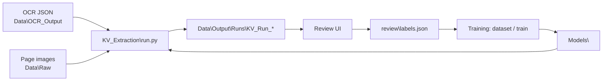

# NER: key/value extraction from chart pages

Local pipeline that reads OCR JSON of chart pages and extracts, in one pass per page:
Member DOB, Member ID, Member Name, Provider Name, Electronic Signature, DOS, Page No and
Headings. Results are reviewed in the Review UI, and the reviews train better extraction
model versions. Everything runs on this machine; no page data leaves it.

How every part works (rules, candidate log, scoring, training): [HOW_IT_WORKS.md](HOW_IT_WORKS.md).



Run every command from the repo root (`E:\Projects\NER`) with the repo `.venv`.

## Setup

The repo runs on **Python 3.13** (`.python-version` = 3.13.15). The `py` launcher may default
to another version, so create the venv explicitly and always start through
`.\.venv\Scripts\python.exe`; any KV entry point started on another interpreter stops.

```powershell
py -3.13 -m venv .venv
.\.venv\Scripts\python.exe -m pip install -r requirements.txt

cd KV_Extraction\Review_UI\frontend
npm install
cd ..\..\..
```

`.env` (copy of `.env.example`) is only needed by `Azure_OCR`; the extraction pipeline and the
Review UI don't read it.

## Paths (`KV_Extraction/Util/config.py`)

The config takes four absolute roots. Set them for the machine the pipeline runs on; every
other path is derived from them.

| Root | Path on this machine | What lives there |
|---|---|---|
| `Raw_Input` | `E:\Projects\NER\Data\Raw` | page images: `{RecordId}\{fileName}` (overlays and the UI) |
| `OCR_Input` | `E:\Projects\NER\Data\OCR_Output` | OCR JSON: `{RecordId}\*.json` (the extraction input) |
| `Output_Root` | `E:\Projects\NER\Data\Output` | everything the pipeline writes |
| `Models_Root` | `E:\Projects\NER\Models` | model folders |

The Output folders are created on the first run (or when the Review UI starts):

```
Data\Output\
├── Runs\          one KV_Run_{timestamp}\ per batch (with its review\) + the active kv_run_queue.json
├── Training\      datasets\, splits\, ner\, optional record_sources.csv
└── Rerun_Logs\    logs of reruns started from the Review UI
```

### Models

`run.py` checks the model folders before anything runs. A public model that is missing is
downloaded from Hugging Face at a pinned revision; only model files come down, nothing is sent.

| Folder under `Models_Root` | Model |
|---|---|
| `gliner_low` | `urchade/gliner_small-v2.1` (+ `microsoft/deberta-v3-small` tokenizer in `encoder\`) |
| `layout_heron` | `docling-project/docling-layout-heron` (heading detector) |
| `kv_ranker\vNNN` | trained extraction versions, built locally from reviews; never downloaded, copy them |

`v0` is the rules and needs nothing under `kv_ranker`. With `HF_HUB_OFFLINE=1` a missing model
stops the run instead of downloading.

## Run the extraction

`run.py` only reads the OCR JSON under `OCR_Input`; it never calls OCR again.

```powershell
# New batch over every document
.\.venv\Scripts\python.exe KV_Extraction\run.py --fresh

# Resume a stopped batch (skips the documents already done; starts a new batch if the last one completed)
.\.venv\Scripts\python.exe KV_Extraction\run.py
```

### Page-count filters

`M` is an exclusive lower limit and `N` an inclusive upper limit. A single value is `N`.

```powershell
# Documents with 20 pages or fewer
.\.venv\Scripts\python.exe KV_Extraction\run.py --fresh -N 20

# Documents with more than 5 and at most 10 pages (6..10)
.\.venv\Scripts\python.exe KV_Extraction\run.py --fresh -N 5 10
.\.venv\Scripts\python.exe KV_Extraction\run.py --fresh -M 5 -N 10

# Documents with more than 10 pages (no upper limit)
.\.venv\Scripts\python.exe KV_Extraction\run.py --fresh -M 10

# Every document (N = 0 means no upper limit; same as no -N)
.\.venv\Scripts\python.exe KV_Extraction\run.py --fresh -N 0
```

### Model versions

`--model-version` picks the extraction model: `v0` is the rules (default), `vNNN` a trained
version under `Models\kv_ranker`.

```powershell
# Rules only
.\.venv\Scripts\python.exe KV_Extraction\run.py --fresh --model-version v0

# A trained version
.\.venv\Scripts\python.exe KV_Extraction\run.py --fresh --model-version v002

# Trained version, only documents with 30 pages or fewer
.\.venv\Scripts\python.exe KV_Extraction\run.py --fresh -N 30 --model-version v002
```

### Rerun an earlier batch

`--records-from` runs exactly the documents of an earlier batch (a folder name under
`Runs\` or a full path). The new batch is scored with the reviews of the earlier one, so
versions can be compared on the same pages.

```powershell
.\.venv\Scripts\python.exe KV_Extraction\run.py --fresh --records-from KV_Run_20260927_174741 --model-version v0
.\.venv\Scripts\python.exe KV_Extraction\run.py --fresh --records-from KV_Run_20260927_174741 --model-version v002
```

The same rerun can be started from the Review UI home page (Rerun button); its log goes to
`Data\Output\Rerun_Logs\`.

### What a batch contains

```
Data\Output\Runs\KV_Run_{timestamp}\
├── run.json                  run summary (documents, times, model version)
├── extraction.xlsx           every field, one workbook
├── detail\{field}\           detail and summary CSVs per field
├── candidates\{RecordId}.csv candidate log with features (training data)
├── overlays\                 per-field images, overall\ (all fields) and heading_heron\
└── review\                   labels.json + manual_review.xlsx, created by the first review
```

Stopping a run with Ctrl+C keeps the queue; run `run.py` without `--fresh` to carry on.
`--fresh` abandons an unfinished queue and starts a new batch.

## Review UI

Start the backend and the frontend in two terminals:

```powershell
# Backend: API on http://127.0.0.1:3000 (reloads on code changes)
.\.venv\Scripts\python.exe -m uvicorn Review_UI.backend.app:app --app-dir KV_Extraction --host 127.0.0.1 --port 3000 --reload
```

```powershell
# Frontend: http://127.0.0.1:3001 (proxies /api to the backend)
cd KV_Extraction\Review_UI\frontend
npm run dev
```

Open [http://127.0.0.1:3001](http://127.0.0.1:3001). The home page lists every batch under
`Data\Output\Runs` with its accuracy; **Review** opens a batch page by page (reviewer name,
each field's pairs, headings, and the Correct Page Sequence Number), **Rerun** starts `run.py`
on the same documents with a chosen model version, and **Detailed view** compares versions on
the same documents. More in [KV_Extraction/Review_UI/README.md](KV_Extraction/Review_UI/README.md).

Accuracy counts a key/value pair as right only when both the key and the value are correct;
a wrong pair or a missed pair counts against it. Overall accuracy covers every module,
headings included.

## Training

Reviews from every batch are pooled (latest review per page and field), then:

```powershell
# 1. Build a dataset from all reviewed batches -> Data\Output\Training\datasets\ds_{time}\
.\.venv\Scripts\python.exe KV_Extraction\Training\dataset.py

# 2. Train a new version -> Models\kv_ranker\vNNN\
.\.venv\Scripts\python.exe KV_Extraction\Training\train.py --description "300 docs"

# 3. Check it: v0 vs the new version on the test split, and held-out accuracy
.\.venv\Scripts\python.exe KV_Extraction\Training\evaluate.py --version v003 --split test
.\.venv\Scripts\python.exe KV_Extraction\Training\crossval.py

# 4. Run with it
.\.venv\Scripts\python.exe KV_Extraction\run.py --fresh --model-version v003
```

Other tools:

```powershell
# Rules accuracy per field on a reviewed batch, listing the wrong / missed pairs of some fields
.\.venv\Scripts\python.exe KV_Extraction\Training\rules_check.py --run KV_Run_20260927_174741 --show dos page_no

# Selected value per page and field in two batches, side by side
.\.venv\Scripts\python.exe KV_Extraction\Training\diff_runs.py KV_Run_A KV_Run_B

# GLiNER training data from fully reviewed pages -> Data\Output\Training\ner\
.\.venv\Scripts\python.exe KV_Extraction\Training\ner_export.py
```

`dataset.py`, `train.py`, `evaluate.py` and `crossval.py` use the latest dataset unless
`--dataset ds_...` is given; `dataset.py` and `ner_export.py` take batch names to limit the input.

## Moving to another system

Copy the code, the models folder (at least `kv_ranker\`) and the inputs (`OCR_Output` and
`Raw`). Set the four roots in `config.py` to where they are on that machine, create the venv,
install `requirements.txt` and the frontend packages, then run `run.py`: the Output folders
are created and the public models download on the first run. The reviews live in
`Output\Runs\*\review\labels.json`; copy the Output folder back to bring them home.

## Layout

| Folder | Role |
|---|---|
| `KV_Extraction\` | extraction pipeline (`run.py`, `pipeline.py`, one folder per field, `Heading\`, `Util\`), `Review_UI\` and `Training\` |
| `Models\` | GLiNER, Heron and trained `kv_ranker` versions |
| `Data\` | `Raw\`, `OCR_Output\` and `Output\` (git-ignored) |
| `Azure_OCR\` | Azure Document Intelligence OCR that produced the OCR JSON (separate from the pipeline) |
| `azure_blob\` | shared blob helpers |
| `V1_MV\` | previous member-verification code |

## Azure OCR (separate step)

Only needed for new documents that have no OCR JSON yet; needs `.env` and `az login`.

```powershell
.\.venv\Scripts\python.exe Azure_OCR\run.py
```

Reads images from `AZURE_OCR_RAW_STORAGE_PREFIX` and writes OCR JSON to
`AZURE_OCR_STORAGE_WRITE_PREFIX`, one record and one page at a time, with its queue in
`Azure_OCR/azure_ocr_progress.json`.

## Previous member verification (`V1_MV`)

The earlier rules + NER member verification, kept for reference; the KV pipeline does not use it.

```powershell
.\.venv\Scripts\python.exe V1_MV\run.py                 # OCR from blob
.\.venv\Scripts\python.exe V1_MV\run_selected.py        # page count <= MAX_PAGES in .env
.\.venv\Scripts\python.exe V1_MV\run_local.py           # OCR JSON on disk
.\.venv\Scripts\python.exe V1_MV\build_member_csvs.py   # member CSVs from a finished batch
```
