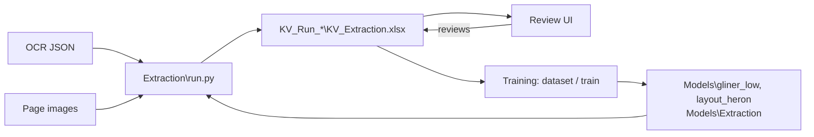

# NER: key/value extraction from chart pages

Local pipeline that reads the OCR JSON of chart pages and extracts, in one pass per page: Member
DOB, Member ID, Member Name, Provider Name, E-Signature, Date of Service, Page No and Headings.
Two separate models do it: **KV_Extraction** (OCR JSON only) and **Heading_Detector** (OCR JSON and
the page image). Each run saves one workbook, reviews are written into it, and that workbook trains
the next model version. Everything runs on this machine; no page data leaves it.

How every part works: [HOW_IT_WORKS.md](HOW_IT_WORKS.md).



Run every command from the repo root (`E:\Projects\NER\NER`) with the repo `.venv`.

## Setup

Python 3.13 (`.python-version`). Create the venv explicitly and always start through it:

```powershell
py -3.13 -m venv .venv
.\.venv\Scripts\python.exe -m pip install -r requirements.txt

cd Extraction\Review_UI\frontend
npm install
cd ..\..\..
```

## Paths (`Extraction/Util/config.py`)

Every path is a full absolute path set in this file and nowhere else; set them for the machine the pipeline runs on.

| Root | What lives there |
|---|---|
| `Raw_Input` | page images `{RecordId}\{fileName}` (heading model, Review UI) |
| `OCR_Input` | OCR JSON `{RecordId}\*.json` (input of both models) |
| `Output_Root` | `Runs\` (one `KV_Run_{timestamp}\` per run), `Training\`, `Rerun_Logs\` |
| `Ner_Model_Path`, `Heading_Models` | the two public base models, `Models\gliner_low` and `Models\layout_heron`: downloaded on the first run when missing |
| `Extraction_Models` | `Models\Extraction\`: the trained models `KV_vNNN` and `Heading_vNNN`, **committed to git** so they travel to another machine |
| `Retired_Models` | `Models\_retired\`: models trained before this layout, kept and never loaded |

A run saves exactly two files: `run.json` and `KV_Extraction.xlsx` (sheets `Member_Name`,
`Member_ID`, `Member_DOB`, `Provider_Name`, `E_Sign`, `DOS`, `Page_No`, `Headings`, `Overall`).

## Run the extraction

```powershell
# New run over every document
.\.venv\Scripts\python.exe Extraction\run.py --fresh

# Resume a stopped run
.\.venv\Scripts\python.exe Extraction\run.py

# Documents with N pages or fewer / more than M and at most N / more than M
.\.venv\Scripts\python.exe Extraction\run.py --fresh -N 5
.\.venv\Scripts\python.exe Extraction\run.py --fresh -N 5 10
.\.venv\Scripts\python.exe Extraction\run.py --fresh -M 10

# Without --model-version a run uses config.Default_Model_Version (v003): it loads its
# KV_Extraction and Heading_Detector models, whichever exist, and keeps the rules for the other.
# v0 is the rules alone.
.\.venv\Scripts\python.exe Extraction\run.py --fresh --model-version v0

# Rerun exactly the documents of an earlier run
.\.venv\Scripts\python.exe Extraction\run.py --fresh --records-from KV_Run_20261002_174224
```

## Review

```powershell
.\.venv\Scripts\python.exe -m uvicorn Review_UI.backend.app:app --app-dir Extraction --host 127.0.0.1 --port 3000 --reload
cd Extraction\Review_UI\frontend; npm run dev      # http://127.0.0.1:3001
```

Close the workbook in Excel while reviewing: the Review UI writes the reviews into it.

## Train

```powershell
.\.venv\Scripts\python.exe Extraction\Training\dataset.py             # reviewed workbooks -> labelled dataset
.\.venv\Scripts\python.exe Extraction\Training\train.py --model both  # KV_Extraction and Heading_Detector, separately
.\.venv\Scripts\python.exe Extraction\Training\evaluate.py --version v003 --split test
```

## Choose records for a training set

`Data Set Chooser\` (see its `START.md`) lists raw records, shows their images and copies the
selected ones to a training folder.
